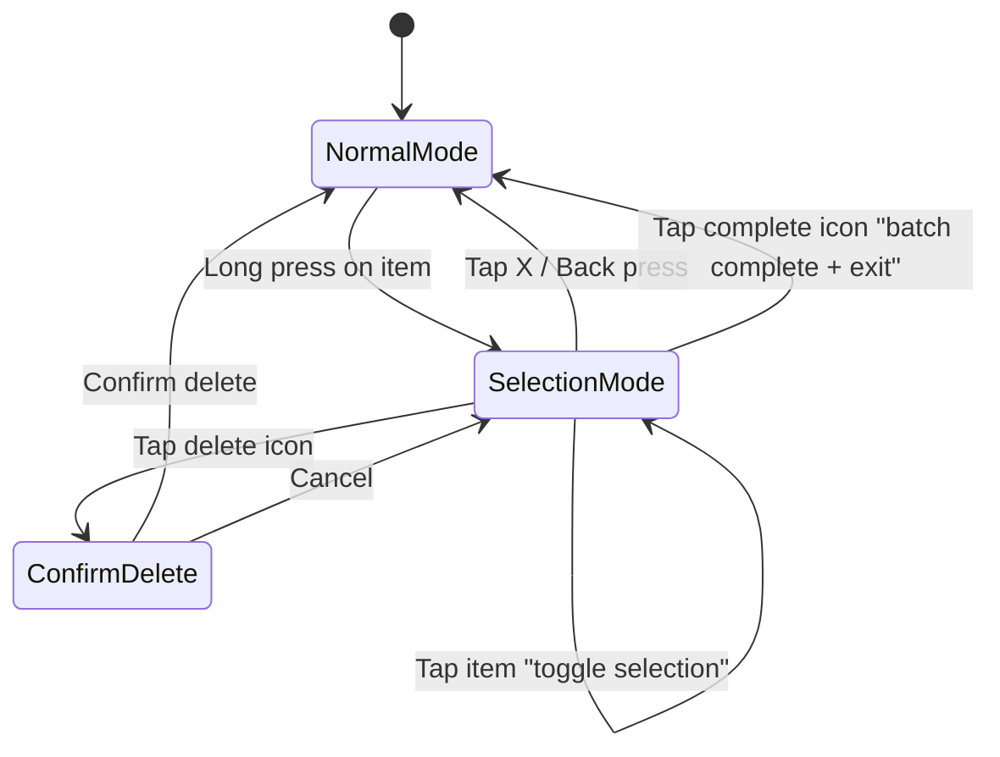

# Checklist Multi-Select with Batch Actions

## Current State

- [ChecklistScreen.kt](android/app/src/main/java/com/voicemind/ui/checklist/ChecklistScreen.kt) displays TO-DO and DONE sections using `ActionItemRow` (private composable). Each row has a `clickable` modifier (navigates to detail) and an `IconButton` for toggling completion. There is **no** long-press or multi-select behavior today.
- [ChecklistViewModel.kt](android/app/src/main/java/com/voicemind/ui/checklist/ChecklistViewModel.kt) holds `ChecklistUiState` with `todoItems` and `doneItems`. Only single-item `toggleCompleted` and `addItem` exist.
- [ActionItemRepository.kt](android/app/src/main/java/com/voicemind/data/repository/ActionItemRepository.kt) has `toggleCompleted(itemId, completed)` and `deleteItem(itemId)` for single items. No batch methods exist.
- [VoiceMindTopAppBar](android/app/src/main/java/com/voicemind/ui/components/VoiceMindTopAppBar.kt) supports `extraActions` slot but has no contextual/selection mode variant.

## UX Design

### Entering Selection Mode

- **Long press** on any `ActionItemRow` (in either TO-DO or DONE section) enters selection mode and selects that item.

### While in Selection Mode

- The **top app bar** transforms into a **contextual action bar**:
  - Left: **Close (X)** button to exit selection mode
  - Title: **"N selected"** count
  - Right actions: **Mark Complete** (checkmark icon) and **Delete** (trash icon) buttons
- Tapping any row **toggles its selection** (instead of navigating to detail).
- The leading icon on each row changes from the completion circle to a **selection checkbox** (checked/unchecked).
- Selected rows get a subtle **highlight background** (`surfaceContainerHigh` or `primaryContainer` with low alpha).
- The FAB is **hidden** while in selection mode to avoid confusion.
- Items from **both** TO-DO and DONE sections can be selected simultaneously.

### Batch Actions

- **Delete**: Deletes all selected items. Shows a confirmation dialog ("Delete N items?").
- **Mark Complete**: Marks all selected incomplete items as complete. Already-complete items are unaffected.
- After a batch action completes, selection mode exits automatically.

### Exiting Selection Mode

- Tap the **X** button on the contextual bar.
- System **back press** also exits selection mode (instead of navigating back).
- After any batch action completes.

---

## Implementation

### 1. Repository -- add batch methods to [ActionItemRepository.kt](android/app/src/main/java/com/voicemind/data/repository/ActionItemRepository.kt)

Add two new methods using Firestore `WriteBatch` for atomicity:

```kotlin
suspend fun deleteItems(itemIds: List<String>) {
    val batch = firestore.batch()
    itemIds.forEach { id -> batch.delete(collection().document(id)) }
    batch.commit().await()
}

suspend fun markCompleted(itemIds: List<String>, completed: Boolean) {
    val batch = firestore.batch()
    itemIds.forEach { id ->
        batch.update(collection().document(id), "completed", completed)
    }
    batch.commit().await()
}
```

### 2. ViewModel -- add selection state to [ChecklistViewModel.kt](android/app/src/main/java/com/voicemind/ui/checklist/ChecklistViewModel.kt)

- Add fields to `ChecklistUiState`:
  - `selectedIds: Set<String>` -- currently selected item IDs
  - `isSelectionMode: Boolean` -- derived as `selectedIds.isNotEmpty()`
- Add ViewModel methods:
  - `onLongPress(itemId: String)` -- enters selection mode, selects the item
  - `toggleSelection(itemId: String)` -- toggles an item in/out of selected set
  - `clearSelection()` -- exits selection mode
  - `deleteSelected()` -- calls `actionItemRepository.deleteItems(...)`, then clears selection
  - `completeSelected()` -- calls `actionItemRepository.markCompleted(...)` for selected incomplete items, then clears selection

### 3. UI -- update [ChecklistScreen.kt](android/app/src/main/java/com/voicemind/ui/checklist/ChecklistScreen.kt)

#### a) `ActionItemRow` -- add selection support

- Add parameters: `isSelectionMode: Boolean`, `isSelected: Boolean`, `onLongPress: () -> Unit`
- Replace `Modifier.clickable` with `Modifier.combinedClickable(onClick, onLongClick = onLongPress)`
- When `isSelectionMode`:
  - `onClick` calls `toggleSelection` instead of `onTaskClick`
  - Leading icon becomes a selection checkbox (`CheckBox` / `CheckBoxOutlineBlank`) instead of the completion circle
  - Row background gets a subtle tint when `isSelected`

#### b) Contextual top bar

- When `isSelectionMode` is true, replace `VoiceMindTopAppBar` with an inline `TopAppBar` showing:
  - Navigation icon: `Close` (X) calling `clearSelection()`
  - Title: `"${selectedIds.size} selected"`
  - Actions: `CheckCircle` icon (mark complete) + `Delete` icon (delete)

#### c) FAB visibility

- Wrap the `FloatingActionButton` in an `AnimatedVisibility(visible = !isSelectionMode)` so it slides/fades out during selection.

#### d) Back handler

- Add `BackHandler(enabled = isSelectionMode) { viewModel.clearSelection() }` so system back exits selection mode instead of leaving the screen.

#### e) Delete confirmation dialog

- Show an `AlertDialog` when the user taps delete, confirming "Delete N items?" with Cancel/Delete buttons.

### Flow Diagram




