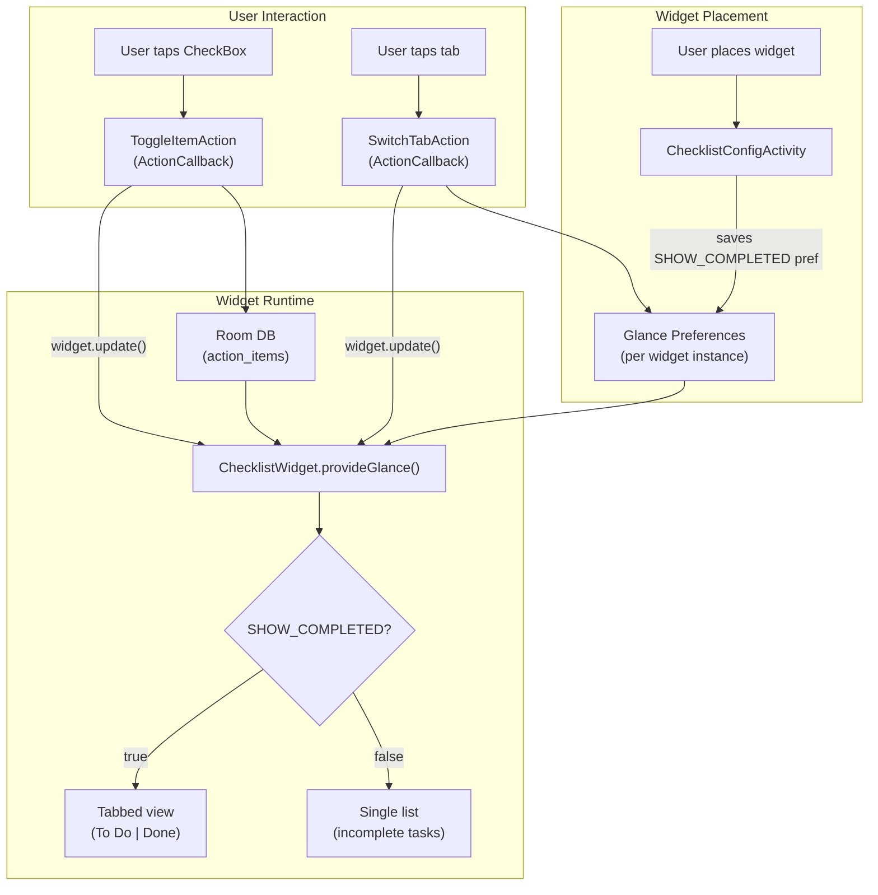

# Checklist Widget Implementation

## Data Layer

The widget reads directly from the existing `action_items` Room table via `ActionItemDao`. No new tables or entities needed.

- **Entity**: `ActionItemEntity` has `completed: Boolean` and `isDeleted: Boolean` ([ActionItemEntity.kt](android/app/src/main/java/com/voicemind/data/local/entity/ActionItemEntity.kt))
- **DAO queries**: `observeAll()` returns all non-deleted items; `updateCompleted()` sets completion + sync status ([ActionItemDao.kt](android/app/src/main/java/com/voicemind/data/local/dao/ActionItemDao.kt))
- **Existing partition logic**: `ChecklistViewModel` already splits items via `items.partition { !it.completed }` ([ChecklistViewModel.kt](android/app/src/main/java/com/voicemind/ui/checklist/ChecklistViewModel.kt), line 45)

Since Glance runs in the app process, we can access Hilt-provided dependencies via `@EntryPoint`:

```kotlin
@EntryPoint
@InstallIn(SingletonComponent::class)
interface ChecklistWidgetEntryPoint {
    fun actionItemDao(): ActionItemDao
}
```

## Architecture




## New Files

All under `android/app/src/main/java/com/voicemind/widget/checklist/`:

- `**ChecklistWidget.kt**` -- `GlanceAppWidget` that reads Room + prefs, renders tab bar (if both mode) + `LazyColumn` of `CheckBox` items. Uses `currentState<Preferences>()` for `SHOW_COMPLETED` and `SELECTED_TAB`. Queries `ActionItemDao` via EntryPoint in `provideGlance`. Reuses `SignedOutContent` and `WidgetTitle` from `widget/common/`.
- `**ChecklistWidgetReceiver.kt**` -- Minimal `GlanceAppWidgetReceiver`, same pattern as [RecordingWidgetReceiver.kt](android/app/src/main/java/com/voicemind/widget/recording/RecordingWidgetReceiver.kt).
- `**ChecklistWidgetStateKeys.kt**` -- Preference keys: `SHOW_COMPLETED` (Boolean), `SELECTED_TAB` (Int, 0=todo, 1=done), `IS_SIGNED_IN` (Boolean).
- `**ChecklistConfigActivity.kt**` -- `ComponentActivity` with Compose UI. Receives `EXTRA_APPWIDGET_ID`, shows two radio options ("Show only incomplete tasks" / "Show both incomplete and completed"), saves choice to Glance preferences via `updateAppWidgetState`, calls `ChecklistWidget().update()`, sets `RESULT_OK`, finishes.
- `**ToggleItemAction.kt**` -- `ActionCallback` that receives item ID via `ActionParameters`, toggles `completed` in Room via DAO (`updateCompleted` with `PENDING_UPDATE`), then calls `ChecklistWidget().update()` to re-render.
- `**SwitchTabAction.kt**` -- `ActionCallback` that receives target tab index via `ActionParameters`, updates `SELECTED_TAB` in Glance preferences, re-renders.
- `**ChecklistWidgetEntryPoint.kt**` -- Hilt `@EntryPoint` interface exposing `ActionItemDao` for use in widget callbacks.

## New Resource Files

- `**res/xml/checklist_widget_info.xml**` -- `appwidget-provider` with `android:configure` pointing to `ChecklistConfigActivity`. Size: `targetCellWidth=4`, `targetCellHeight=3`, `resizeMode="vertical"`, `minWidth=250dp`, `minHeight=110dp`.
- `**res/layout/checklist_widget_initial.xml**` -- Static placeholder layout (title + checklist icon) for the widget picker, following the pattern in [widget_initial.xml](android/app/src/main/res/layout/widget_initial.xml).

## Modified Files

- **[AndroidManifest.xml](android/app/src/main/AndroidManifest.xml)** -- Add:
  - `<receiver>` for `ChecklistWidgetReceiver` with `APPWIDGET_UPDATE` filter and `@xml/checklist_widget_info` metadata
  - `<activity>` for `ChecklistConfigActivity` with `APPWIDGET_CONFIGURE` intent filter
- **[WidgetStateManager.kt](android/app/src/main/java/com/voicemind/widget/common/WidgetStateManager.kt)** -- Add `refreshChecklistWidgets(context)` method that calls `updateWidgetState<ChecklistWidget>` to push auth state and triggers re-render. Add `pushChecklistAuthState` for sign-in state.
- **[VoiceMindApp.kt](android/app/src/main/java/com/voicemind/VoiceMindApp.kt)** -- Update `pushWidgetState()` to also call `WidgetStateManager.pushChecklistAuthState()` so the checklist widget reflects sign-in state.
- `**res/values/strings.xml`** -- Add `checklist_widget_name` ("VoiceMind Checklist") and `checklist_widget_description`.

## Widget UI Design

**Tab Bar** (shown only in "both" mode):

```
[ To Do (5) | Done (3) ]
```

- Row of two clickable boxes, selected tab gets `WidgetColors.Accent` background with `WidgetColors.White` text, unselected gets `WidgetColors.AccentContainer` with `WidgetColors.Label` text
- Item counts shown in parentheses

**Task Row** (each item in LazyColumn):

```
[x] Task title text here
```

- Glance `CheckBox` composable with `onCheckedChange` wired to `ToggleItemAction`
- Task title as the text label, single line with ellipsis

**Empty State**: Centered text "No tasks yet" or "All done!" depending on the tab.

**Signed-out State**: Reuses `SignedOutContent()` from [SharedWidgetContent.kt](android/app/src/main/java/com/voicemind/widget/common/SharedWidgetContent.kt).

## Key Design Decisions

- **Room access via Hilt EntryPoint** -- Widgets run in the app process, so we use `EntryPointAccessors.fromApplication()` to get the DAO. Avoids duplicating database construction.
- **Sync via existing SyncWorker** -- Toggle writes to Room with `SyncStatus.PENDING_UPDATE`. The existing `SyncWorker` picks up pending changes on its next run. No direct Firestore calls from widget callbacks.
- **Per-instance config** -- Each widget instance stores its own `SHOW_COMPLETED` preference via Glance's per-widget-instance DataStore, so users can have multiple widgets with different modes.
- **Widget refresh** -- After any in-widget interaction (toggle, tab switch), the callback calls `ChecklistWidget().update(context, glanceId)` immediately. App-side changes (sync, in-app edits) are propagated by calling `ChecklistWidget().updateAll(context)` from `WidgetStateManager`.

