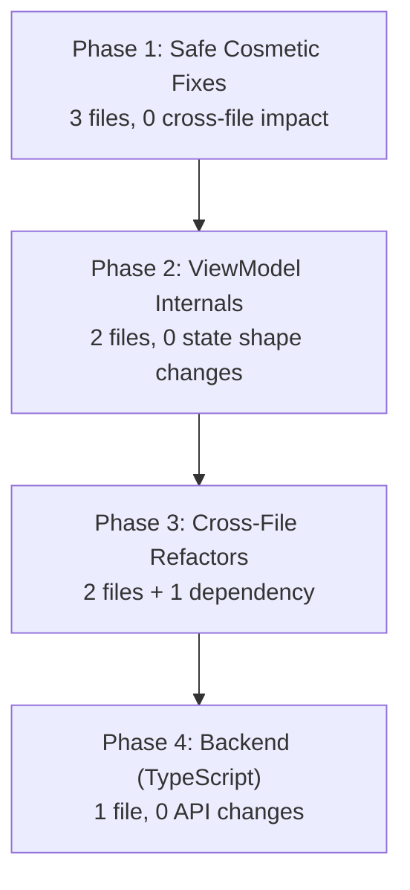

# Code Guidelines Compliance Fixes

## Phasing Strategy

Changes are batched by **dependency risk** — self-contained internal refactors first, then ViewModel internals, then cross-file changes, then backend. Each phase can be built and verified independently.




---

## Phase 1 — Safe Cosmetic Fixes (0 cross-file impact)

These changes are purely internal — no public API, state shape, or function signature changes. Nothing outside these files needs to update.

### 1a. `RecordingWidget.kt` — Extract duplicated prompt composable

**Problem:** `SignedOutContent()` and `MicPermissionContent()` are near-identical (title + subtitle + button).

**Fix:** Extract a shared `private fun PromptContent(subtitle, buttonLabel, intent)` composable. Both callers become one-liners.

**Downstream impact:** None. `RecordingService.kt` and `VoiceMindApp.kt` only call `RecordingWidget().update(...)` and write to `RecordingWidgetStateKeys` — they never touch these private composables. `RecordingWidgetReceiver` in the same file is unaffected.

**File:** [android/app/src/main/java/com/voicemind/widget/RecordingWidget.kt](android/app/src/main/java/com/voicemind/widget/RecordingWidget.kt)

### 1b. `SharedSummaryDetailScreen.kt` — Remove `!!`

**Problem:** Line 169 uses `state.summary!!` inside an else-branch.

**Fix:** Replace the `else ->` block with a `state.summary?.let { summary -> ... }` or `val summary = checkNotNull(state.summary)`.

**Downstream impact:** None. The screen is only referenced by `AppNavHost.kt` which passes `ownerUid`, `summaryId`, and `onBack` — none change.

**File:** [android/app/src/main/java/com/voicemind/ui/sharing/SharedSummaryDetailScreen.kt](android/app/src/main/java/com/voicemind/ui/sharing/SharedSummaryDetailScreen.kt)

### 1c. `SummariesScreen.kt` — Remove emoji from UI text

**Problem:** Line 320 uses `\u2728` (sparkle emoji) in instructional text.

**Fix:** Remove the emoji. Change to `"Tap the Summarize button in the toolbar."` (the action is already clear from context).

**Downstream impact:** None. Text-only change in a private composable.

**File:** [android/app/src/main/java/com/voicemind/ui/summaries/SummariesScreen.kt](android/app/src/main/java/com/voicemind/ui/summaries/SummariesScreen.kt)

---

## Phase 2 — ViewModel Internal Refactors (0 state shape changes)

These changes refactor private methods inside ViewModels. The `UiState` data classes and public method signatures stay identical, so consuming screens are unaffected.

### 2a. `SharedRecordingDetailViewModel.kt` — Extract MediaPlayer setup helper

**Problem:** `playOrResume()` (lines 174-206) and `retryWithFreshUrl()` (lines 330-363) both construct a `MediaPlayer` with nearly identical listener wiring (onPrepared, onCompletion, onError, prepareAsync).

**Fix:** Extract a `private fun buildAndPreparePlayer(url: String, onError: (Int, Int) -> Boolean): MediaPlayer` that encapsulates the common setup. Both callers pass their specific error-handling strategy.

**Key concern:** `playOrResume` includes retry logic in its error listener (`urlRetryCount`), while `retryWithFreshUrl` does not. The extracted helper should accept the error listener as a lambda parameter so the callers can customize behavior.

**Downstream impact:** None. `SharedRecordingDetailUiState` is unchanged. `SharedRecordingDetailScreen.kt` only reads state and calls public methods — all of which keep their signatures.

**File:** [android/app/src/main/java/com/voicemind/ui/sharing/SharedRecordingDetailViewModel.kt](android/app/src/main/java/com/voicemind/ui/sharing/SharedRecordingDetailViewModel.kt)

### 2b. `SettingsViewModel.kt` — Extract shared reauth-then-delete flow

**Problem:** `reauthAndDeleteWithGoogle()` and `reauthAndDelete()` duplicate the pattern: set Deleting -> reauth -> deleteAccount -> handle success/failure.

**Fix:** Extract a `private fun executeReauthAndDelete(reauthBlock: suspend () -> Result<Unit>)` that both methods call, passing their specific reauth call as a lambda.

```kotlin
private fun executeReauthAndDelete(reauthBlock: suspend () -> Result<Unit>) {
    _deleteState.value = DeleteAccountState.Deleting
    viewModelScope.launch(Dispatchers.IO) {
        reauthBlock()
            .onSuccess {
                authRepository.deleteAccount()
                    .onSuccess { _deleteState.value = DeleteAccountState.Success }
                    .onFailure { e ->
                        _deleteState.value = DeleteAccountState.Error(
                            e.message ?: "Failed to delete account"
                        )
                    }
            }
            .onFailure { e ->
                _deleteState.value = DeleteAccountState.Error(
                    e.message ?: "Re-authentication failed"
                )
            }
    }
}
```

**Downstream impact:** None. `SettingsScreen.kt` calls `reauthAndDeleteWithGoogle(idToken)` and `reauthAndDelete(email, password)` — both keep their signatures. `DeleteAccountState` and `StorageInfo` are unchanged.

**File:** [android/app/src/main/java/com/voicemind/ui/settings/SettingsViewModel.kt](android/app/src/main/java/com/voicemind/ui/settings/SettingsViewModel.kt)

---

## Phase 3 — Cross-File Refactors

These changes touch more than one file and require coordinated edits.

### 3a. `AppNavHost.kt` — Hoist duplicated LaunchedEffects

**Problem:** The `LaunchedEffect(openSharedItemsOnStart)` block is copy-pasted identically in both the sidebar and bottom-bar branches.

**Fix:** Hoist the shared-items LaunchedEffect **above** the `if (useSidebar)` branch. It uses `navController.navigate(SHARED_ITEMS_ROUTE)` in both cases — no difference.

The recordings deep-link differs between branches (sidebar calls `navigateTo(Routes.Recordings)`, bottom-bar calls `pagerState.scrollToPage(recIndex)`). This one **cannot** be hoisted as-is; it stays duplicated but is correct. Add a brief comment explaining why.

**Downstream impact:** `MainActivity.kt` is the sole caller of `AppNavHost`. Its signature does not change. Behavior is preserved.

**File:** [android/app/src/main/java/com/voicemind/ui/navigation/AppNavHost.kt](android/app/src/main/java/com/voicemind/ui/navigation/AppNavHost.kt)

### 3b. `SignInScreen.kt` + `AuthViewModel.kt` — Move Google credential flow to ViewModel

**Problem:** The Google Sign-In `onClick` handler (lines 212-236) is 25 lines of inline coroutine logic in the composable. DeveloperGuide says composables should be "mostly pure" with logic in the ViewModel.

**Fix:**

1. Add a `fun signInWithGoogleCredential(activity: Activity)` method to `AuthViewModel` that encapsulates the `CredentialManager` flow (get credential -> extract idToken -> call existing `signInWithGoogle(idToken)`). On cancellation, it does nothing; on `NoCredentialException`, it calls `setError(...)`.
2. In `SignInScreen.kt`, replace the inline lambda with a simple call: `viewModel.signInWithGoogleCredential(context as Activity)`.

**Key concern:** `AuthViewModel` currently takes an `idToken: String` in `signInWithGoogle`. The new method wraps the credential manager flow *around* it, so the existing method stays untouched. `MainActivity.kt` also uses `AuthViewModel` but only calls `signOut()`, `registerFcmToken()`, and reads `isSignedIn` — none of which change.

**Files:**

- [android/app/src/main/java/com/voicemind/ui/auth/SignInScreen.kt](android/app/src/main/java/com/voicemind/ui/auth/SignInScreen.kt)
- [android/app/src/main/java/com/voicemind/ui/auth/AuthViewModel.kt](android/app/src/main/java/com/voicemind/ui/auth/AuthViewModel.kt)

---

## Phase 4 — Backend (TypeScript)

### 4a. `googleTasks.ts` — Extract error helper + split long function

**Problem:**

- The error-casting pattern `const e = err as { code?: number; status?: number }` appears 7 times.
- `syncActionItemToGoogleTasks` is 141 lines — the longest function in the file.

**Fix:**

1. Add a typed helper at the top of the file:

```typescript
function getHttpCode(err: unknown): number | undefined {
    const e = err as { code?: number; status?: number };
    return e.code ?? e.status;
}
```

1. Replace all 7 instances of the cast+check pattern with calls to `getHttpCode(err)`.
2. Extract the body of `syncActionItemToGoogleTasks` into focused helpers:
  - `handleSoftDelete(tasks, calendar, event, taskId, calEventId, uid)` — lines 292-302
  - `syncTaskToGoogle(tasks, event, taskBody, taskId, itemId, uid)` — lines 343-361
  - `syncCalendarEvent(calendar, event, title, dueDate, notes, calEventId, itemId, uid)` — lines 364-390

**Downstream impact:** None. The three exported symbols (`exchangeTasksAuthCode`, `disconnectTasks`, `syncActionItemToGoogleTasks`) keep their signatures. `functions/src/index.ts` re-exports via `export * from "./googleTasks.js"` — no change needed. The Android client calls these via `getHttpsCallable("exchangeTasksAuthCode")` etc. — function names unchanged.

**Verification:** Run `npm run build` in `functions/` to confirm TypeScript compiles. The compiled `functions/lib/googleTasks.js` will regenerate automatically.

**File:** [functions/src/googleTasks.ts](functions/src/googleTasks.ts)

---

## Hardcoded Dimensions (Deferred)

Several files use raw `dp` values where `VmDimens` constants exist (e.g., `16.dp` instead of `VmDimens.ScreenHorizontalPadding`). These are **low-severity cosmetic issues** spread across many files. I recommend deferring them to a separate sweep after the functional fixes above are verified, to keep diffs focused. The mapping is:

- `16.dp` -> `VmDimens.SpaceLg` or `VmDimens.ScreenHorizontalPadding` (context-dependent)
- `24.dp` -> `VmDimens.SpaceXl`
- `32.dp` -> `VmDimens.SpaceXxl`
- `8.dp` -> `VmDimens.SpaceSm`
- `12.dp` -> `VmDimens.SpaceMd`
- `4.dp` -> `VmDimens.SpaceXs`
- `48.dp` -> `VmDimens.SpaceXxxl` or `VmDimens.TouchTarget`

---

## Verification After Each Phase

After each phase:

1. Confirm the project builds (`./gradlew assembleDebug` for Android, `npm run build` for functions)
2. Verify no lint regressions in modified files
3. Spot-check the screen/function still works as expected

