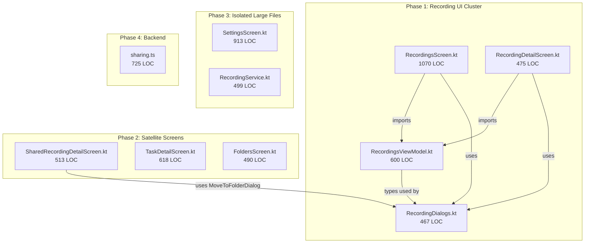

# Code Standards Audit & Remediation Plan

## Audit of `RecordingsScreen.kt` (Primary File)

The file has **11 violations** against the three guides:

### Violations Found

**1. Composable exceeds ~200 lines (DeveloperGuide S4)**
`RecordingsScreen` spans lines 131-545 (~415 lines). The guide says "If a Composable exceeds ~200 lines, extract sub-composables."

**2. File is 1070 lines with 8 private composables inlined (DeveloperGuide S8)**
`SummarizationPopup`, `PulseRingIcon`, `CompletionToast`, `MultiSelectTopBar`, `BulkMoveToFolderDialog`, `MultiSelectHintBanner`, `RecordingRow` are all private composables that should be extracted — some to `ui/components/` (reusable) and some to separate files in `ui/recording/`.

**3. `BulkMoveToFolderDialog` duplicates `MoveToFolderDialog` (DeveloperGuide S1 DRY, S14)**
`[RecordingsScreen.kt](android/app/src/main/java/com/voicemind/ui/recording/RecordingsScreen.kt)` lines 798-830 reimplement a folder-picker dialog that already exists as `MoveToFolderDialog` in `[RecordingDialogs.kt](android/app/src/main/java/com/voicemind/ui/recording/RecordingDialogs.kt)`. The only difference is an added folder icon per row.

**4. NeedsInternet dialog block is copy-pasted (DeveloperGuide S1 DRY, S14)**
The exact same `when (reason) { ... }` mapping + `AlertDialog` block appears in both `RecordingsScreen.kt` (lines 472-493) and `RecordingDetailScreen.kt`. This should be extracted to a shared composable.

**5. Clipboard logic lives in the composable (DeveloperGuide S5 MVVM boundaries)**
Lines 337-343: `onCopyTranscript` contains `ClipboardManager` + `Toast.makeText` logic directly in the composable lambda. Per MVVM boundaries, this side-effect logic belongs in the ViewModel or a utility. Additionally, it uses the Android `ClipboardManager` while other screens use Compose `LocalClipboardManager` (inconsistent API).

**6. Hardcoded `16.dp` instead of `VmDimens.ScreenHorizontalPadding` (Patterns_Guide S10)**
Line 226 uses `Modifier.padding(horizontal = 16.dp)` while line 270 correctly uses `VmDimens.ScreenHorizontalPadding`. The Screen Layout Structure pattern requires consistent use of `VmDimens`.

**7. Processing status chip is not shared (DeveloperGuide S4 Reuse)**
Lines 1036-1067 inline a processing status chip pattern that is conceptually duplicated in `RecordingDialogs.kt` (`TranscriptContent`). This should be a shared `ProcessingStatusChip` composable.

**8. `RecordingRow` is too large (~180 lines) and not reusable (DeveloperGuide S4, S8)**
The `RecordingRow` composable (lines 870-1070) handles multi-select indicator, play/download state, title/date, overflow menu, and processing chip — all in one block. The overflow menu logic alone is ~50 lines.

**9. Toast.makeText instead of Snackbar (Patterns_Guide S8c)**
Line 342 uses Android `Toast.makeText` for "Transcript copied" feedback instead of the M3 `Snackbar` pattern documented in Patterns_Guide S8c.

**10. `folderId` parameter shadows outer scope (DeveloperGuide S2)**
Line 525: the `onMove` lambda parameter `folderId` shadows the `folderId` parameter of `RecordingsScreen` on line 134.

**11. Missing `key()` on some items (Patterns_Guide S4a)**
The `LazyColumn` has `key` on grouped items but the completion toast and other overlays don't use stable keys where relevant — minor but worth noting.

---

## Phased Execution Plan

### Rationale for Phasing

Files are grouped by **coupling** — files that import each other, share types, or have duplicated code between them are fixed together to prevent breakage.

---

### Phase 1: Recording UI Cluster (4 files, highest risk)

These four files are tightly coupled through shared types, composable imports, and duplicated patterns. They **must** be fixed together.

#### Phase 1A — Extract shared components (create reusable pieces)

- **Extract `NeedsInternetDialog`** from `RecordingsScreen.kt` (lines 472-493) into `[ui/components/](android/app/src/main/java/com/voicemind/ui/components/)`. Remove the duplicate from `RecordingDetailScreen.kt`. Single shared composable that takes `reason: NeedsInternetReason?` and `onDismiss: () -> Unit`.
- **Unify `BulkMoveToFolderDialog` with `MoveToFolderDialog`** — Add an optional `leadingIcon` or `showFolderIcon` parameter to `MoveToFolderDialog` in `RecordingDialogs.kt`, then delete `BulkMoveToFolderDialog` from `RecordingsScreen.kt`. Update `RecordingsScreen.kt` to use the extended `MoveToFolderDialog`.
- **Extract `ProcessingStatusChip`** into `ui/components/`. Takes a `Recording` (or just `transcription: String?`, `processingFailed: Boolean`, `syncStatus: SyncStatus`) and renders the appropriate chip.
- **Move clipboard logic to ViewModel** — Move `onCopyTranscript` logic into `RecordingsViewModel.copyTranscriptToClipboard(recording)`. Use Compose `LocalClipboardManager` or a consistent utility pattern. Switch from `Toast` to `Snackbar`.

#### Phase 1B — Decompose `RecordingsScreen.kt`

Split the 1070-line file by extracting private composables into their own files:

- `RecordingRow.kt` — `RecordingRow` + overflow menu (the row is large enough and specific enough to warrant its own file within `ui/recording/`)
- `SummarizationPopup.kt` — `SummarizationPopup` + `PulseRingIcon` (stay in `ui/recording/`, these are recording-specific)
- `CompletionToast.kt` — Move to `ui/components/` if generic, or keep in `ui/recording/` with recording branding
- `MultiSelectTopBar` — Evaluate whether checklist's inline selection bar can share this; if not, keep in `ui/recording/` as a separate file
- `MultiSelectHintBanner` — Small, can stay or move to `ui/components/` if summaries could reuse it

After extraction, `RecordingsScreen.kt` should be ~300-350 lines: just the main composable orchestrating state, calling sub-composables, and hosting dialogs.

#### Phase 1C — Fix `RecordingsViewModel.kt`

- Move `NeedsInternetReason` to a shared location (e.g., `ui/common/NeedsInternetReason.kt` or alongside the new `NeedsInternetDialog` component) since it's used by multiple screens
- Add `copyTranscriptToClipboard()` method
- Review for other guide violations (check for `!!`, main-thread blocking, etc.)

#### Phase 1D — Fix `RecordingDetailScreen.kt`

- Remove duplicated NeedsInternet dialog block — use the new shared `NeedsInternetDialog`
- Evaluate: duplicated transcript/summary/tasks tab orchestration vs `TranscriptSheet` in `RecordingDialogs.kt` — extract shared tab content
- Check composable length (~400 lines, needs sub-extraction)

#### Phase 1E — Fix `RecordingDialogs.kt`

- Apply `ProcessingStatusChip` shared component in `TranscriptContent`
- Verify dialog patterns match Patterns_Guide S2
- Fix `16.dp` vs `VmDimens` inconsistencies
- Review composable sizes

---

### Phase 2: Satellite Screens (3 files, medium risk)

These files have light coupling to Phase 1 outputs (use `MoveToFolderDialog`, shared components) but are otherwise independent.

#### Phase 2A — `SharedRecordingDetailScreen.kt` (513 LOC)

- Audit against guides: composable length, pattern conformance
- Uses `MoveToFolderDialog` from `RecordingDialogs.kt` — verify it works with any Phase 1 changes
- Uses Compose `LocalClipboardManager` (correct pattern — no change needed)
- Check for parallel drift with `RecordingDetailScreen` (similar product shape)

#### Phase 2B — `TaskDetailScreen.kt` (618 LOC)

- Audit against guides: composable length, date picker patterns
- Largely isolated — no coupling to Phase 1 files
- Check MVVM boundaries, state management, dialog patterns

#### Phase 2C — `FoldersScreen.kt` (490 LOC)

- Audit: check if GlassCard + row + chevron patterns should be extracted
- `FolderNameDialog` — verify dialog pattern matches Patterns_Guide S2
- Check for `VmDimens` usage consistency

---

### Phase 3: Isolated Large Files (2 files, lower risk)

These are independent of Phases 1-2 and each other.

#### Phase 3A — `SettingsScreen.kt` (913 LOC)

- **Critical issue:** One giant composable spanning ~750 lines — needs major decomposition
- Extract sections into private composables: navigation settings, storage, NTS, timezone, account, integrations
- Check MVVM boundaries (settings logic in composable vs ViewModel)
- Verify Settings Section Pattern (Patterns_Guide S11)

#### Phase 3B — `RecordingService.kt` (499 LOC)

- Service code, not UI — audit against DeveloperGuide S3 (coroutines), S7 (audio recording), S9 (logging)
- Flag any `runBlocking` usage — it's been spotted; should use coroutines properly
- Check for main-thread blocking, proper cancellation, wake lock management

---

### Phase 4: Backend (1 file, independent)

#### Phase 4A — `functions/src/sharing.ts` (725 LOC)

- TypeScript, not Kotlin — DeveloperGuide/Patterns_Guide don't directly apply
- Audit against Android_Developer_Brief.md S12: verify function signatures, collections, fields match what the brief defines
- Check for repeated auth checks, error handling patterns across handlers
- Look for opportunities to extract shared helper functions (rate limit, auth guard, Firestore access)

---

## Execution Notes

- **Always build-verify** after each phase to catch breakage
- Phase 1 is the **critical path** — Phases 2-4 can proceed in parallel after Phase 1 is complete
- Each phase should be a separate commit for easy rollback
- When extracting composables to new files, update all import sites immediately
- Run lint checks after each sub-phase

