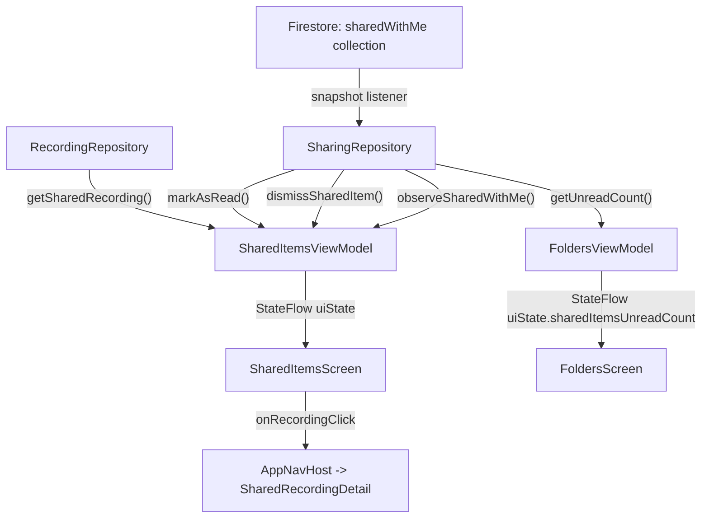

# Phase 4: Shared Items Folder UI -- Execution Plan

## Current State

Phase 3 (data layer) is **fully implemented**: `SharedItem.kt`, `MyShare.kt`, `SharingRepository.kt` (with all needed methods), plus cross-user read methods on `RecordingRepository` and `ActionItemRepository`.

Phase 4 has **navigation and UI shells done** (routes, AppNavHost, FoldersScreen row, SharedItemsScreen empty state), but the **ViewModel and live-data wiring are missing**.

### What's already done (no changes needed)

- [Routes.kt](android/app/src/main/java/com/voicemind/ui/navigation/Routes.kt): `SHARED_ITEMS_ROUTE` defined
- [AppNavHost.kt](android/app/src/main/java/com/voicemind/ui/navigation/AppNavHost.kt): `composable(SHARED_ITEMS_ROUTE)` registered, `onRecordingClick` wired to `sharedRecordingDetailRoute()`
- [FoldersScreen.kt](android/app/src/main/java/com/voicemind/ui/folders/FoldersScreen.kt): `SharedItemsRow` pinned at top of LazyColumn
- [SharedItemsScreen.kt](android/app/src/main/java/com/voicemind/ui/sharing/SharedItemsScreen.kt): Scaffold, top bar, empty-state card, `SectionHeader` composable

### What needs to be built

---

## Task 1: Add one-shot `getSharedRecording` to RecordingRepository

**File:** [RecordingRepository.kt](android/app/src/main/java/com/voicemind/data/repository/RecordingRepository.kt)

Add a one-shot cross-user read method (the existing `observeSharedRecording` is a Flow/listener -- we need a simple `suspend` get for fetching titles in a list):

```kotlin
suspend fun getSharedRecording(ownerUid: String, recordingId: String): Recording? = try {
    firestore.document("users/$ownerUid/recordings/$recordingId")
        .get().await().toObject(Recording::class.java)
} catch (e: Exception) {
    Timber.e(e, "getSharedRecording")
    null
}
```

Follows the same pattern as the existing `getRecording()` method at line 95.

---

## Task 2: Add unread count to FoldersViewModel

**File:** [FoldersViewModel.kt](android/app/src/main/java/com/voicemind/ui/folders/FoldersViewModel.kt)

- Inject `SharingRepository` into constructor
- Add `sharedItemsUnreadCount: Int = 0` field to `FoldersUiState`
- Collect `sharingRepository.getUnreadCount()` alongside existing `combine` block (use a separate `launch` or add to `combine`)

Approach: Add a separate `launch` block (cleanest, avoids changing the existing 3-way combine):

```kotlin
@HiltViewModel
class FoldersViewModel @Inject constructor(
    private val folderRepository: FolderRepository,
    private val recordingRepository: RecordingRepository,
    private val navPreferenceRepository: NavPreferenceRepository,
    private val sharingRepository: SharingRepository,  // NEW
) : ViewModel() {
    init {
        // existing combine block stays unchanged...
        
        viewModelScope.launch {
            sharingRepository.getUnreadCount().collect { count ->
                _uiState.update { it.copy(sharedItemsUnreadCount = count) }
            }
        }
    }
}
```

Note: Need to change `_uiState.value = ...` in the existing combine block to `_uiState.update { ... }` for thread safety since two coroutines now write to the same state.

---

## Task 3: Add badge to SharedItemsRow in FoldersScreen

**File:** [FoldersScreen.kt](android/app/src/main/java/com/voicemind/ui/folders/FoldersScreen.kt)

- Pass `state.sharedItemsUnreadCount` to `SharedItemsRow`
- Add `unreadCount: Int` parameter to `SharedItemsRow`
- Display a Material 3 `Badge` on the row when `unreadCount > 0`, positioned between the label and the chevron

```kotlin
SharedItemsRow(
    onClick = onSharedItemsClick,
    unreadCount = state.sharedItemsUnreadCount,
)
```

Badge styling: use `Badge { Text("$count") }` from M3, tinted with `MaterialTheme.colorScheme.error` (standard M3 badge).

---

## Task 4: Create SharedItemsViewModel

**New file:** [SharedItemsViewModel.kt](android/app/src/main/java/com/voicemind/ui/sharing/SharedItemsViewModel.kt)

### UI model

```kotlin
data class SharedItemUiModel(
    val shareId: String,
    val ownerUid: String,
    val ownerName: String,
    val ownerEmail: String,
    val itemType: String,
    val itemId: String,
    val itemTitle: String,
    val sharedAt: Timestamp?,
    val isRead: Boolean,
)

data class SharedItemsUiState(
    val recordings: List<SharedItemUiModel> = emptyList(),
    val summaries: List<SharedItemUiModel> = emptyList(),
    val isLoading: Boolean = true,
)
```

### ViewModel logic

```kotlin
@HiltViewModel
class SharedItemsViewModel @Inject constructor(
    private val sharingRepository: SharingRepository,
    private val recordingRepository: RecordingRepository,
) : ViewModel() {
    private val _uiState = MutableStateFlow(SharedItemsUiState())
    val uiState: StateFlow<SharedItemsUiState> = _uiState
    
    init {
        viewModelScope.launch {
            sharingRepository.observeSharedWithMe().collect { items ->
                val enriched = items.map { item ->
                    val title = when (item.itemType) {
                        "recording" -> recordingRepository
                            .getSharedRecording(item.ownerUid, item.itemId)
                            ?.title ?: "Untitled Recording"
                        "collectiveSummary" -> "Collective Summary"
                        else -> "Shared Item"
                    }
                    SharedItemUiModel(
                        shareId = item.id,
                        ownerUid = item.ownerUid,
                        ownerName = item.ownerName,
                        ownerEmail = item.ownerEmail,
                        itemType = item.itemType,
                        itemId = item.itemId,
                        itemTitle = title,
                        sharedAt = item.sharedAt,
                        isRead = item.isRead,
                    )
                }
                _uiState.value = SharedItemsUiState(
                    recordings = enriched.filter { it.itemType == "recording" },
                    summaries = enriched.filter { it.itemType == "collectiveSummary" },
                    isLoading = false,
                )
            }
        }
        markAllAsRead()
    }
    
    fun dismiss(shareId: String) {
        viewModelScope.launch(Dispatchers.IO) {
            sharingRepository.dismissSharedItem(shareId)
        }
    }
    
    private fun markAllAsRead() {
        viewModelScope.launch(Dispatchers.IO) {
            sharingRepository.observeSharedWithMe()
                .first()
                .filter { !it.isRead }
                .forEach { sharingRepository.markAsRead(it.id) }
        }
    }
}
```

Key design decisions:

- **Title enrichment**: One-shot cross-user Firestore reads (via Task 1's `getSharedRecording`). For large lists, these are parallel-izable with `async` if needed -- start simple.
- **Mark as read on open**: When the screen opens (`init`), mark all unread items as read (clears the badge on the Folders screen).
- **Dismiss**: Calls the `dismissSharedItem` Cloud Function which handles full cleanup (removes from `sharedWithMe`, `myShares`, `sharedWith` array).
- **Real-time updates**: `observeSharedWithMe()` is a Firestore snapshot listener -- new shares appear immediately.

---

## Task 5: Wire SharedItemsScreen to ViewModel

**File:** [SharedItemsScreen.kt](android/app/src/main/java/com/voicemind/ui/sharing/SharedItemsScreen.kt)

Major changes:

- Add `hiltViewModel()` to obtain `SharedItemsViewModel`
- Collect `uiState` via `collectAsStateWithLifecycle()`
- Replace hardcoded booleans with real state
- Render recording items as tappable rows (GlassCard-based) with dismiss action
- Render summary items similarly
- Add `onDismiss` callback on each row (swipe-to-dismiss or icon button)

### Recording row composable

```kotlin
@Composable
private fun SharedRecordingRow(
    item: SharedItemUiModel,
    onClick: () -> Unit,
    onDismiss: () -> Unit,
) {
    GlassCard(modifier = Modifier.fillMaxWidth(), onClick = onClick) {
        Row(verticalAlignment = Alignment.CenterVertically) {
            Column(modifier = Modifier.weight(1f)) {
                Text(item.itemTitle, style = MaterialTheme.typography.bodyLarge)
                Text(
                    "Shared by ${item.ownerName}",
                    style = MaterialTheme.typography.bodySmall,
                    color = MaterialTheme.colorScheme.onSurfaceVariant,
                )
            }
            IconButton(onClick = onDismiss) {
                Icon(Icons.Default.Close, contentDescription = "Dismiss")
            }
        }
    }
}
```

### Screen wiring

```kotlin
@Composable
fun SharedItemsScreen(
    onBack: () -> Unit,
    onRecordingClick: (ownerUid: String, recordingId: String) -> Unit = { _, _ -> },
    viewModel: SharedItemsViewModel = hiltViewModel(),
) {
    val state by viewModel.uiState.collectAsStateWithLifecycle()
    // Use state.recordings, state.summaries, state.isLoading
    // Replace hardcoded booleans
}
```

Items in LazyColumn will use `items(state.recordings, key = { it.shareId })` for efficient recomposition.

---

## Data Flow Diagram




---

## Action Items for the User

1. **Ensure Cloud Functions are deployed**: Phase 2 functions (`shareItem`, `dismissSharedItem`, `findUserByEmail`, etc.) must be live on Firebase for the dismiss and data flow to work. If not deployed yet, run:

```bash
   cd functions && npm run deploy
   

```

1. **Ensure Firestore security rules are deployed**: The cross-user read rules for `recordings`, `collectiveSummaries`, and `actionItems` (checking `sharedWith` array) must be live.
2. **Test data**: To verify the feature end-to-end, you need at least two Firebase Auth accounts. Use the Firebase Console (or a second device/emulator) to manually create a `sharedWithMe` document under one user's path, or use the `shareItem` Cloud Function from the other account.
3. **No new dependencies needed**: All imports (`hilt`, `compose`, `firebase-firestore`, `firebase-functions`) are already in the project's `build.gradle.kts`.

