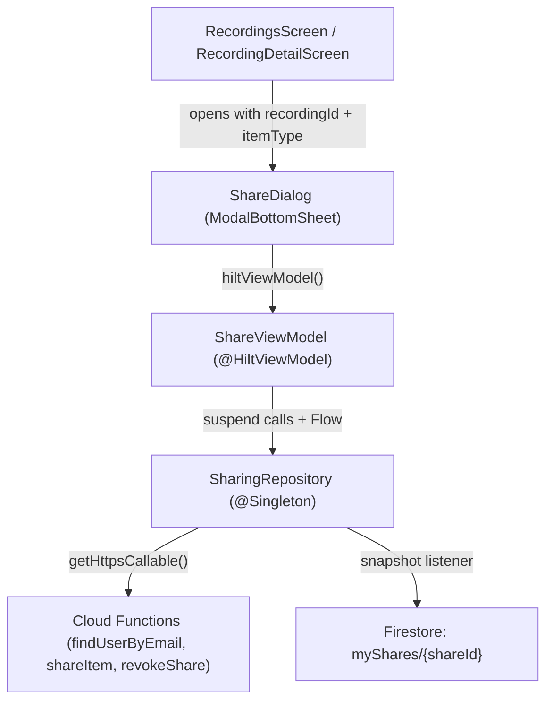

# Complete Phase 5: Share Flow UI (Sender Side)

## Current State

Phase 5 is partially complete. The UI scaffolding exists but everything is hardcoded/no-op:

- **Done**: "Share with User" menu action in [RecordingsScreen.kt](android/app/src/main/java/com/voicemind/ui/recording/RecordingsScreen.kt) (line 358) and [RecordingDetailScreen.kt](android/app/src/main/java/com/voicemind/ui/recording/RecordingDetailScreen.kt) (line 297)
- **Done**: [ShareDialog.kt](android/app/src/main/java/com/voicemind/ui/sharing/ShareDialog.kt) UI shell with visual states (Idle/Loading/Found/NotFound/AlreadyShared)
- **Not done**: `ShareViewModel.kt` does not exist
- **Not done**: ShareDialog is entirely no-op (Find always sets NotFound, Share dismisses, Shared With section uses `emptyList()`)
- **Not done**: Manage Shares section never shows real data

## Architecture Overview

## Implementation Steps

### Step 1: Create `ShareViewModel.kt`

Create [android/app/src/main/java/com/voicemind/ui/sharing/ShareViewModel.kt](android/app/src/main/java/com/voicemind/ui/sharing/ShareViewModel.kt)

Following the existing ViewModel pattern (see `SharedItemsViewModel` and `SettingsViewModel`):

- `@HiltViewModel` with `@Inject constructor(sharingRepository: SharingRepository)`
- State: `ShareUiState` data class with fields:
  - `lookupState: LookupState` (Idle/Loading/Found/NotFound/AlreadyShared/Error)
  - `foundUser: FoundUser?` (uid, displayName, email)
  - `isSharing: Boolean`
  - `shareSuccess: Boolean`
  - `shareError: String?`
  - `myShares: List<MyShare>` (current recipients)
  - `isRevoking: Set<String>` (shareIds currently being revoked, for per-button loading)
- Methods:
  - `fun setItem(itemId: String, itemType: String)` - sets the item context and starts observing `observeMyShares(itemId)`
  - `fun findUser(email: String)` - calls `sharingRepository.findUserByEmail()`, checks if already shared (by comparing against `myShares`), updates state
  - `fun shareItem(recipientUid: String)` - calls `sharingRepository.shareItem()`, handles `already-exists` error from `FirebaseFunctionsException`
  - `fun revokeShare(shareId: String, recipientUid: String)` - calls `sharingRepository.revokeShare()`
  - `fun resetLookup()` - clears lookup state back to Idle
  - `fun clearShareSuccess()` - resets shareSuccess flag

Key error handling: catch `FirebaseFunctionsException` and check `code == ALREADY_EXISTS` to set AlreadyShared state. Map other errors to user-friendly messages per DeveloperGuide.md Section 2 (Errors).

### Step 2: Refactor `ShareDialog.kt`

Modify [ShareDialog.kt](android/app/src/main/java/com/voicemind/ui/sharing/ShareDialog.kt) to:

1. **Accept ViewModel via `hiltViewModel()`** in the `ShareDialog` composable
2. **Pass `recordingId` and `itemType` into `ShareDialogContent`** (currently only `onDismiss` is passed)
3. **Call `viewModel.setItem(recordingId, itemType)` via `LaunchedEffect`** to initialize the ViewModel with the item context
4. **Replace local `LookupState` enum** - delete the private enum; use the ViewModel's state instead
5. **Wire "Find" button**: call `viewModel.findUser(email)` instead of hardcoding NotFound
6. **Wire "Share" button**: call `viewModel.shareItem(foundUser.uid)` with loading indicator, dismiss or show success on completion
7. **Wire the "Shared with" section**: observe `viewModel.uiState.myShares` instead of `emptyList()` placeholder
8. **Wire "Revoke" buttons**: call `viewModel.revokeShare(share.id, share.recipientUid)` with per-button loading state
9. **Show success feedback**: brief "Shared successfully" text or auto-dismiss after sharing
10. **Show error feedback**: display error messages from ViewModel state

Specific UI changes:

- Replace hardcoded "Jane Smith" with `foundUser.displayName` and `foundUser.email`
- Replace `placeholderRecipients` (`emptyList<String>()`) with `state.myShares` (`List<MyShare>`)
- Each recipient row shows `share.recipientName`, `share.recipientEmail`, and a `PersonRemove` IconButton
- Add `CircularProgressIndicator` overlay on Share/Revoke buttons during operations
- Move `LookupState` enum into ViewModel state or keep as sealed interface in the ViewModel file

### Step 3: Handle Edge Cases

- **Email validation**: basic check before calling findUser (contains "@", non-empty)
- **Self-share prevention**: if looked-up user UID matches current user, show appropriate message
- **Already shared detection**: cross-reference `foundUser.uid` against `myShares.recipientUid` list to show "Already shared" state locally even before hitting the Cloud Function
- **Keyboard handling**: dismiss keyboard after tapping "Find"
- **Empty email field**: "Find" button already disabled via `email.isNotBlank()`

## Files Changed

| File                           | Change                                                               |
| ------------------------------ | -------------------------------------------------------------------- |
| `ui/sharing/ShareViewModel.kt` | **New** - ViewModel with find/share/revoke logic                     |
| `ui/sharing/ShareDialog.kt`    | **Modified** - Wire to ViewModel, replace all no-ops with real calls |

No changes needed to:

- `SharingRepository.kt` (already has all required methods)
- `RecordingsScreen.kt` / `RecordingDetailScreen.kt` (already pass `recordingId` and `itemType` to `ShareDialog`)
- `MyShare.kt` / `SharedItem.kt` (models are complete)
- Cloud Functions (already deployed with all required callables)
- Navigation / Routes (no new screens needed)

## Action Items for You (Non-Code / Ops)

Before testing Phase 5, ensure:

1. **Cloud Functions are deployed** - all 5 sharing callables (`findUserByEmail`, `shareItem`, `revokeShare`, `dismissSharedItem`, `getSharedAudioUrl`) must be deployed to Firebase. Run `firebase deploy --only functions` from the `functions/` directory.
2. **Firestore security rules are deployed** - the cross-user read rules for recordings, collectiveSummaries, and actionItems must be live. Run `firebase deploy --only firestore:rules`.
3. **Two test accounts needed** - you need two VoiceMind user accounts to test sharing end-to-end. Both must have signed in at least once (to create their profile documents with `displayName` and `email`).
4. **Discoverability** - ensure at least one test account has `discoverable: true` (default) so `findUserByEmail` returns results.

## Verification Checklist

After implementation, test these scenarios:

- Email lookup finds discoverable users and returns "No user found" for non-discoverable or non-existent users
- Found user card shows correct name and email from Firebase
- Sharing creates inbox/outbox entries and updates `sharedWith` array (verify in Firestore console)
- Duplicate share attempt is rejected gracefully (shows "Already shared with this user")
- "Shared with" section shows current recipients in real-time
- Revoke removes access and cleans up all entries
- Recipient's Shared Items updates in real time when share is created or revoked
- Self-share attempt is handled gracefully
- Error states (network failure, function timeout) show user-friendly messages

