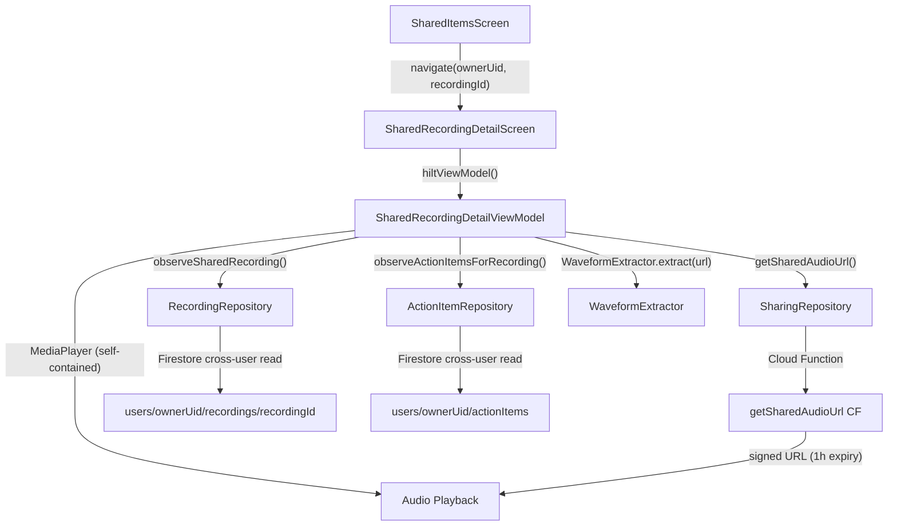

# Complete Phase 6: Shared Recording Detail Screen and Audio Playback

## Current State

Phase 6 is partially scaffolded. Navigation and the UI shell exist but everything is hardcoded/placeholder:

- **Done**: Route `SHARED_RECORDING_DETAIL_ROUTE` in [Routes.kt](android/app/src/main/java/com/voicemind/ui/navigation/Routes.kt) (line 53)
- **Done**: `composable(SHARED_RECORDING_DETAIL_ROUTE)` in [AppNavHost.kt](android/app/src/main/java/com/voicemind/ui/navigation/AppNavHost.kt) (line 249)
- **Done**: Navigation wiring -- `SharedItemsScreen` row click calls `onRecordingClick(ownerUid, itemId)` which navigates to detail
- **Done**: [SharedRecordingDetailScreen.kt](android/app/src/main/java/com/voicemind/ui/sharing/SharedRecordingDetailScreen.kt) UI shell (260 lines of placeholders)
- **Not done**: `SharedRecordingDetailViewModel.kt` does not exist
- **Not done**: All screen content is hardcoded ("Shared Recording", "Shared by Someone", "0:00.0", disabled controls, placeholder text sections)

## Architecture




## Key Design Decisions

**Self-contained MediaPlayer in ViewModel** -- The existing `RecordingsViewModel` tightly couples MediaPlayer with the `PlaybackService` (notification controls, foreground service). Shared recording playback is simpler (no notification, no service). The ViewModel will own its own MediaPlayer instance and release it in `onCleared()`.

**Signed URL lifecycle** -- The signed URL from `getSharedAudioUrl` expires after 1 hour. The ViewModel tracks the fetch timestamp and proactively refreshes it before expiry. If MediaPlayer hits an error on an expired URL, it refreshes and retries once.

**Owner name lookup** -- The `SharedRecordingDetailScreen` needs the owner's display name for "Shared by [Name]". This is not in the `Recording` document. We add a small helper to `SharingRepository` to look up the `sharedWithMe` entry for this recording.

**DRY: extract shared playback components** -- Per DeveloperGuide: "Promote on second use." Two components from `RecordingDetailScreen.kt` are now needed in a second place:

- `formatMmSsDecimal()` -- extract to a shared utility
- `SpeedBubble` -- extract to `ui/components/`

## Implementation Steps

### Step 1: Extract shared playback components

**Extract `formatMmSsDecimal`** from [RecordingDetailScreen.kt](android/app/src/main/java/com/voicemind/ui/recording/RecordingDetailScreen.kt) (line 79) into a new file `ui/components/TimeFormatting.kt` (or a common util). Make it `internal` so both screens can use it.

**Extract `SpeedBubble`** from [RecordingDetailScreen.kt](android/app/src/main/java/com/voicemind/ui/recording/RecordingDetailScreen.kt) (lines 87-195) along with `speedSteps` into a new file `ui/components/SpeedBubble.kt`. Update `RecordingDetailScreen.kt` to import from the new location. Remove the `private` visibility.

### Step 2: Add owner name lookup to SharingRepository

Add to [SharingRepository.kt](android/app/src/main/java/com/voicemind/data/repository/SharingRepository.kt):

```kotlin
suspend fun getSharedItemForRecording(itemId: String): SharedItem? =
    sharedWithMeCollection()
        .whereEqualTo("itemId", itemId)
        .limit(1)
        .get().await()
        .toObjects(SharedItem::class.java)
        .firstOrNull()
```

### Step 3: Create SharedRecordingDetailViewModel

Create [SharedRecordingDetailViewModel.kt](android/app/src/main/java/com/voicemind/ui/sharing/SharedRecordingDetailViewModel.kt):

- **Constructor**: `SavedStateHandle`, `RecordingRepository`, `SharingRepository`, `ActionItemRepository`
- **Nav args**: `ownerUid` and `recordingId` from `SavedStateHandle`
- **State** (`SharedRecordingDetailUiState`):
  - `recording: Recording?` -- from `observeSharedRecording`
  - `ownerName: String` -- from `sharedWithMe` lookup
  - `tasks: List<ActionItem>` -- from `observeActionItemsForRecording`
  - `isLoading: Boolean`
  - `error: String?`
  - `audioUrl: String?` -- signed URL from Cloud Function
  - `isPlaying: Boolean`, `isPaused: Boolean`
  - `positionMs: Long`, `durationMs: Long`
  - `playbackSpeed: Float`
  - `waveformBars: List<Float>`, `isExtractingWaveform: Boolean`
- **Init block**:
  1. Launch coroutine to observe `recordingRepository.observeSharedRecording(ownerUid, recordingId)` -- updates `recording` in state
  2. Launch coroutine to observe `actionItemRepository.observeActionItemsForRecording(ownerUid, recordingId)` -- updates `tasks` in state
  3. Launch coroutine on `Dispatchers.IO` to:
    - Fetch owner name via `sharingRepository.getSharedItemForRecording(recordingId)`
    - Fetch signed URL via `sharingRepository.getSharedAudioUrl(ownerUid, recordingId)`
    - Record `urlFetchedAt` timestamp
    - Extract waveform via `WaveformExtractor.extract(url)`
- **Playback methods** (modeled on `RecordingsViewModel` patterns but simplified -- no `PlaybackService`):
  - `playOrResume()` -- if MediaPlayer exists and paused, resume; otherwise create new MediaPlayer with signed URL, `prepareAsync()`, play on prepared
  - `pause()`
  - `seekTo(positionMs: Long)`
  - `skipForward5()` / `skipBackward5()`
  - `cycleSpeed()` / `setSpeed(speed: Float)`
  - `startPositionPolling()` -- private, polls `mediaPlayer.currentPosition` every 100ms
  - `refreshAudioUrlIfNeeded()` -- private, checks if URL is older than 50 minutes, fetches new one if so
- **URL expiry handling**:
  - Store `urlFetchedAt: Long` (System.currentTimeMillis)
  - Before `playOrResume()`, check `System.currentTimeMillis() - urlFetchedAt > 50 * 60 * 1000`
  - If expired, fetch new URL, update `audioUrl`, restart MediaPlayer with new source
  - On `MediaPlayer` error callback, attempt one URL refresh and retry
- `**onCleared()`**: stop position polling, release MediaPlayer

### Step 4: Wire SharedRecordingDetailScreen to ViewModel

Refactor [SharedRecordingDetailScreen.kt](android/app/src/main/java/com/voicemind/ui/sharing/SharedRecordingDetailScreen.kt):

- Inject `SharedRecordingDetailViewModel` via `hiltViewModel()`
- Collect state via `collectAsStateWithLifecycle()`
- **Top bar**: show `recording.title` (or "Loading..." while null), "Shared by ${ownerName}" subtitle
- **Time display**: show `formatMmSsDecimal(positionMs)` and `formatMmSsDecimal(durationMs)` using extracted utility
- **Waveform**: replace placeholder `GlassCard` with `AudioWaveform` component (already in `ui/components/`), pass `waveformBars`, `progress`, `isExtracting`, and `onSeek` callback
- **Transport controls**: wire skip backward/play-pause/skip forward to ViewModel methods, enable all controls when `audioUrl != null`
- **Speed bubble**: use the extracted `SpeedBubble` component
- **Transcription section**: show `recording.transcription ?: "No transcription available"` with functional copy button
- **Summary section**: show `recording.summary ?: "No summary available"` with functional copy button
- **Tasks section**: show real task list from `state.tasks`, each as a read-only row (title + completion status). Show "No tasks" when empty
- **Loading state**: show `CircularProgressIndicator` when `isLoading`
- **Error state**: show error message if URL fetch fails
- **Copy buttons**: wire `ContentCopy` icons to `ClipboardManager` for transcription and summary text

### Step 5: Handle edge cases

- **No transcription**: show "No transcription available" in muted text instead of blank
- **No summary**: show "No summary available" in muted text
- **No tasks**: show "No tasks" or hide the section
- **Audio load failure**: show error state, allow retry
- **URL expiry mid-playback**: transparent refresh (no UI interruption)
- **Recording deleted by owner while viewing**: `observeSharedRecording` will emit `null`, show "This recording is no longer available"

## Files Changed


| File                                           | Change                                                                                                   |
| ---------------------------------------------- | -------------------------------------------------------------------------------------------------------- |
| `ui/sharing/SharedRecordingDetailViewModel.kt` | **New** -- ViewModel with playback, data observation, URL management                                     |
| `ui/sharing/SharedRecordingDetailScreen.kt`    | **Modified** -- Replace all placeholders with ViewModel-driven UI                                        |
| `ui/components/SpeedBubble.kt`                 | **New** -- Extracted from RecordingDetailScreen                                                          |
| `ui/components/TimeFormatting.kt`              | **New** -- Extracted `formatMmSsDecimal` utility                                                         |
| `ui/recording/RecordingDetailScreen.kt`        | **Modified** -- Import `SpeedBubble` and `formatMmSsDecimal` from shared location, remove private copies |
| `data/repository/SharingRepository.kt`         | **Modified** -- Add `getSharedItemForRecording()` method                                                 |


**No changes needed to:**

- `Routes.kt` / `AppNavHost.kt` (already wired)
- `SharedItemsScreen.kt` (navigation already works)
- `RecordingRepository.kt` (`observeSharedRecording` already exists)
- `ActionItemRepository.kt` (`observeActionItemsForRecording` already exists)
- Cloud Functions (all already deployed from Phase 2)

## Action Items for You (Non-Code / Ops)

1. **Cloud Functions must be deployed** -- specifically `getSharedAudioUrl` (used for signed URL generation). If not deployed from Phase 2/5, run `firebase deploy --only functions`.
2. **Two test accounts needed** -- one account must have shared a recording with the other so that the recipient can open the shared recording detail screen.
3. **Test recording must have content** -- the shared recording should have transcription, summary, and tasks to verify all sections render correctly.
4. **Firestore security rules deployed** -- cross-user read rules for `recordings` and `actionItems` collections must be live.

## Verification Checklist

- Shared recording detail screen displays title, transcription, summary, and tasks correctly
- "Shared by [ownerName]" attribution appears in the top bar
- Audio plays from signed URL (tap play, hear audio)
- Seek via waveform scrubber works
- Skip forward/backward 5 seconds works
- Speed control works (tap to cycle, drag to select)
- Time display updates in real-time during playback
- All content is read-only -- no edit/delete options available
- Live updates: if owner edits recording title/summary/transcription, changes reflect for recipient
- Back navigation works correctly
- Copy-to-clipboard works for transcription and summary
- Recording deleted by owner while viewing shows appropriate message
- No crashes on URL expiry (refreshes transparently)

