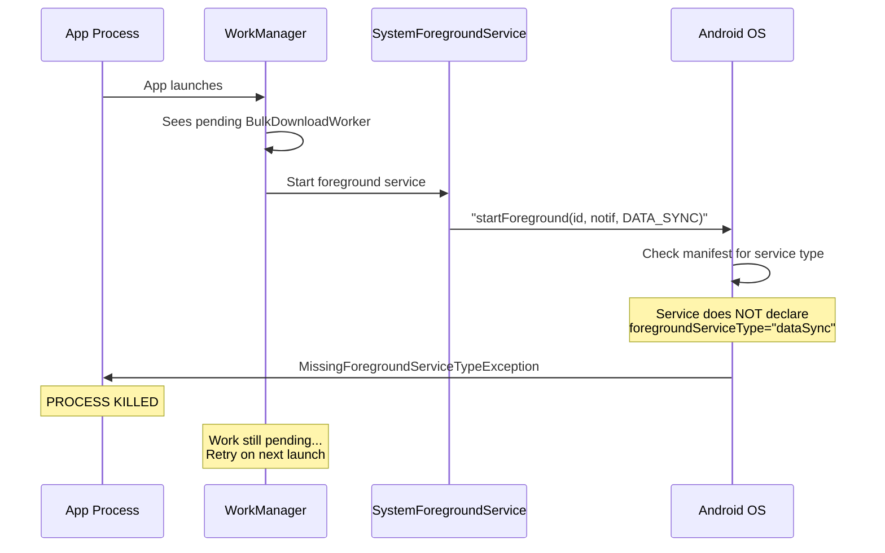

# Fix BulkDownloadWorker Crash Loop

## Why the App Is Stuck in a Crash Loop

The previous fix added the `FOREGROUND_SERVICE_DATA_SYNC` permission and passed `ServiceInfo.FOREGROUND_SERVICE_TYPE_DATA_SYNC` to `ForegroundInfo`. But that is only **two of three** requirements on Android 14+ (API 34, your targetSdk=35).

The missing third requirement: **WorkManager's internal `SystemForegroundService` must declare `foregroundServiceType="dataSync"` in the manifest `<service>` element.**

WorkManager runs all foreground workers via its own service (`androidx.work.impl.foreground.SystemForegroundService`). The WorkManager 2.10.0 library declares this service in its own manifest, but does NOT include `dataSync` in the service type. When the `BulkDownloadWorker` calls `setForeground()`, WorkManager tells this service to call `Service.startForeground(id, notification, FOREGROUND_SERVICE_TYPE_DATA_SYNC)`. The Android system then checks the manifest, sees the service doesn't declare `dataSync`, and throws `MissingForegroundServiceTypeException` -- which kills the process.

Because WorkManager persists work requests in its own SQLite database, the `BulkDownloadWorker` is retried on every app restart, creating an infinite crash loop.



## Fix (2 changes + 1 recovery step)

### 1. Declare the foreground service type on WorkManager's service

In [AndroidManifest.xml](android/app/src/main/AndroidManifest.xml), add a `<service>` override that merges with WorkManager's declaration:

```xml
<service
    android:name="androidx.work.impl.foreground.SystemForegroundService"
    android:foregroundServiceType="dataSync"
    tools:node="merge" />
```

This merges with WorkManager's own manifest and adds `dataSync` as an allowed foreground service type.

### 2. Wrap `setForeground()` in try/catch as a safety net

In [BulkDownloadWorker.kt](android/app/src/main/java/com/voicemind/data/sync/BulkDownloadWorker.kt), wrap the `setForeground()` calls in try/catch so that if the foreground service still can't start for any reason (e.g., app is in background on API 31+, missing notification permission, etc.), the worker falls back to running as a regular background job instead of crashing the process.

The initial `setForeground()` on line 33 and the progress updates on line 48 both need wrapping.

### 3. Break the current crash loop

After deploying the fix from Android Studio, the crash loop should break automatically because the new code handles the foreground service correctly. If the app still won't start, the user can go to **Android System Settings > Apps > VoiceMind > Storage > Clear Data** to clear WorkManager's persisted state.
