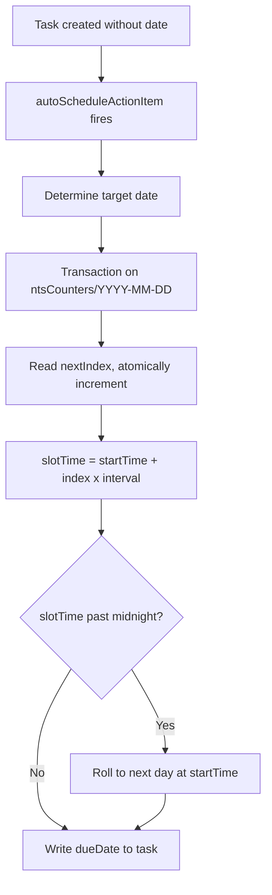

# Fix NTS Race Condition

## Root Cause

The `autoScheduleActionItem` Cloud Function trigger fires concurrently for every task created without a date. Each instance queries existing tasks, sees the same occupied set, and independently picks the same "first free slot." This is a textbook race condition -- the query-then-write is not atomic.

## Fix: Atomic Counter Per Target Date

Replace the query-based slot finding with a **Firestore transaction on a counter document** that atomically assigns each trigger a unique sequential slot index.




### How it works

- A small counter document `users/{uid}/ntsCounters/{YYYY-MM-DD}` stores `{ nextIndex: number }` for each target date
- Each trigger runs a Firestore transaction: read `nextIndex`, take it as this task's slot index, atomically increment it
- The assigned time is simply `startTime + (slotIndex * intervalMinutes)` -- no query needed
- Firestore transactions are serializable, so concurrent triggers are guaranteed to get different indices (0, 1, 2, 3, ...)

### Why this is correct

Even if 5 triggers fire simultaneously:

- Trigger A gets index 0 -> 10:00 PM
- Trigger B gets index 1 -> 10:15 PM
- Trigger C gets index 2 -> 10:30 PM
- Trigger D gets index 3 -> 10:45 PM
- Trigger E gets index 4 -> 11:00 PM

The counter is the single source of truth for "how many NTS slots have been assigned today." No query race possible.

### What about the pre-existing task at 10:00 PM?

The pre-existing task was manually set to 10:00 PM. The NTS system should assign its own sequential slots independently. Calendar and Google Tasks can have overlapping events -- the purpose of NTS is to ensure a reminder fires, not to avoid calendar conflicts. If the user wants a different start time, they can change it in settings.

This simplification removes the fragile query-based conflict detection entirely. The counter-based approach is both simpler and correct.

## Single File Change: [functions/src/index.ts](functions/src/index.ts)

### Changes to `autoScheduleActionItem` (lines 1305-1406)

Replace the current logic (lines 1365-1401) -- the query, occupied-set construction, and slot-finding loop -- with:

1. Compute `targetDateStr` (e.g., `"2026-03-23"`) from the already-computed target date components
2. Run a Firestore transaction on `users/{uid}/ntsCounters/{targetDateStr}`:
  - Read the counter document
  - If it doesn't exist, initialize `nextIndex` to `0`
  - Take `slotIndex = nextIndex`
  - Write `nextIndex = slotIndex + 1`
3. Calculate `slotUtc = windowStartUtc + (slotIndex * intervalMs)`
4. If `slotUtc >= windowEndUtc`, roll forward (same as current code)
5. Write `dueDate` and `autoScheduled: true` to the action item

### Remove

- The `existingSnap` query (lines 1366-1372)
- The `occupiedUtcMs` Set construction (lines 1375-1384)
- The slot-finding `for` loop (lines 1386-1395)

### Add

```typescript
const targetDateStr = `${targetYear}-${String(targetMonth + 1).padStart(2, "0")}-${String(targetDay).padStart(2, "0")}`;
const counterRef = db
  .collection("users").doc(uid)
  .collection("ntsCounters").doc(targetDateStr);

let slotIndex = 0;
await db.runTransaction(async (tx) => {
  const counterDoc = await tx.get(counterRef);
  slotIndex = counterDoc.exists ? (counterDoc.data()?.nextIndex ?? 0) : 0;
  tx.set(counterRef, { nextIndex: slotIndex + 1 }, { merge: true });
});

const intervalMs = intervalMinutes * 60_000;
let slotUtc = new Date(windowStartUtc.getTime() + slotIndex * intervalMs);

if (slotUtc >= windowEndUtc) {
  slotUtc = windowEndUtc; // rolls to next day's start time
}
```

## Cleanup Consideration

The `ntsCounters` subcollection will accumulate one small document per day. These are tiny (a single integer field) and can be cleaned up with a scheduled Cloud Function later if desired, but they have negligible storage impact.