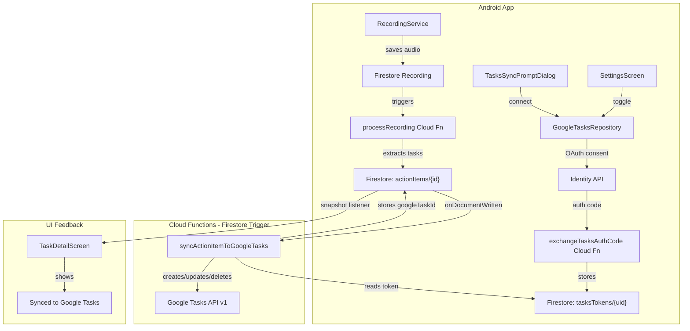

# Google Calendar to Google Tasks Migration

## Context

The app currently syncs action items (extracted from voice recordings) to **Google Calendar** as events. The integration spans three layers:

- **Android app**: OAuth consent flow via `GoogleCalendarRepository`, UI in Settings and TaskDetail
- **Firebase Cloud Functions**: Token exchange, Firestore trigger that creates/updates/deletes Calendar events
- **Firestore**: Stores tokens in `calendarTokens/{uid}`, connection status on `users/{uid}`, and `calendarEventId` on each action item

## What Changes

### Google Cloud Console (Manual -- you do this)

1. **Enable the Google Tasks API** in your Google Cloud project (project ID from `google-services.json`, likely project `685270102033`). Go to [Google Cloud Console > APIs & Services > Library](https://console.cloud.google.com/apis/library) and enable "Tasks API".
2. The existing OAuth client credentials (web client ID `685270102033-...`) and client secret remain the same -- no new credentials needed. The `googleapis` npm package already includes the Tasks API client.

### Layer 1: Android App (Kotlin)

**Files to modify (7 files):**

- [GoogleCalendarRepository.kt](android/app/src/main/java/com/voicemind/data/repository/GoogleCalendarRepository.kt) -- Rename to `GoogleTasksRepository.kt`
  - Change `CALENDAR_SCOPE` from `calendar.events` to `https://www.googleapis.com/auth/tasks`
  - Rename sealed interface `CalendarConnectResult` to `TasksConnectResult`
  - Rename class to `GoogleTasksRepository`
  - Rename all methods: `requestCalendarAccess` -> `requestTasksAccess`, `disconnectCalendar` -> `disconnectTasks`
  - Change Cloud Function names called: `exchangeCalendarAuthCode` -> `exchangeTasksAuthCode`, `disconnectCalendar` -> `disconnectTasks`
  - Change Firestore field observed: `calendarConnected` -> `tasksConnected`
- [ActionItem.kt](android/app/src/main/java/com/voicemind/data/model/ActionItem.kt) -- Rename field `calendarEventId` to `googleTaskId`
- [SettingsViewModel.kt](android/app/src/main/java/com/voicemind/ui/settings/SettingsViewModel.kt) -- Update to use `GoogleTasksRepository` and `TasksConnectResult`; rename state fields from `calendar*` to `tasks*`
- [SettingsScreen.kt](android/app/src/main/java/com/voicemind/ui/settings/SettingsScreen.kt) -- Change UI labels from "Google Calendar" to "Google Tasks"; update subtitle text
- [MainViewModel.kt](android/app/src/main/java/com/voicemind/ui/main/MainViewModel.kt) -- Update to use `GoogleTasksRepository` and `TasksConnectResult`
- [MainActivity.kt](android/app/src/main/java/com/voicemind/MainActivity.kt) -- Rename `calendarPromptDismissed` -> `tasksPromptDismissed`, update references to `CalendarSyncPromptDialog` -> `TasksSyncPromptDialog`
- [CalendarSyncPromptDialog.kt](android/app/src/main/java/com/voicemind/ui/components/CalendarSyncPromptDialog.kt) -- Rename to `TasksSyncPromptDialog.kt`; update title to "Sync Google Tasks", update description text to explain Google Tasks sync instead of Calendar sync
- [TaskDetailScreen.kt](android/app/src/main/java/com/voicemind/ui/checklist/TaskDetailScreen.kt) -- Change `calendarEventId` to `googleTaskId`; change "Synced to Google Calendar" to "Synced to Google Tasks"; change icon from `CalendarToday` to `TaskAlt` or `CheckCircle`

### Layer 2: Firebase Cloud Functions (TypeScript)

**File to modify:** [functions/src/index.ts](functions/src/index.ts)

- **Rename `exchangeCalendarAuthCode` -> `exchangeTasksAuthCode`**
  - Same OAuth token exchange logic (unchanged)
  - Store in `tasksTokens/{uid}` instead of `calendarTokens/{uid}`
  - Set `tasksConnected: true` on `users/{uid}` instead of `calendarConnected`
- **Rename `disconnectCalendar` -> `disconnectTasks`**
  - Revoke token from `tasksTokens/{uid}`
  - Set `tasksConnected: false`
- **Replace `syncActionItemToCalendar` with `syncActionItemToGoogleTasks`**
  - Same Firestore trigger on `users/{uid}/actionItems/{itemId}`
  - Guard: skip if only `googleTaskId` changed (instead of `calendarEventId`)
  - Read refresh token from `tasksTokens/{uid}`
  - Use `google.tasks({ version: "v1", auth: oauth2Client })` instead of `google.calendar`
  - **Create task**: `tasks.tasks.insert({ tasklist: "@default", requestBody: { title, notes, due } })`
  - **Update task**: `tasks.tasks.update({ tasklist: "@default", task: taskId, requestBody: { ... } })`
  - **Delete task**: `tasks.tasks.delete({ tasklist: "@default", task: taskId })`
  - **Completion sync**: When `completed` changes on an action item, update the task's `status` field (`needsAction` vs `completed`)
  - Store the Google Task ID back as `googleTaskId` on the Firestore document
- **Replace `buildCalendarEvent` with `buildGoogleTask`**
  - Google Tasks `due` field is an RFC 3339 timestamp (e.g., `2024-03-15T14:00:00.000Z`)
  - Map: `title` -> `title`, `notes` -> `notes`, `dueDate` or `deadline` -> `due`, `completed` -> `status`

### Google Tasks API Shape (Reference)

```typescript
// Create a task
const res = await tasks.tasks.insert({
  tasklist: "@default",
  requestBody: {
    title: "VoiceMind Task",
    notes: "Some notes",
    due: "2024-03-15T14:00:00.000Z",  // RFC 3339
    status: "needsAction",            // or "completed"
  },
});
const googleTaskId = res.data.id;

// Update a task
await tasks.tasks.update({
  tasklist: "@default",
  task: googleTaskId,
  requestBody: { title, notes, due, status },
});

// Delete a task
await tasks.tasks.delete({
  tasklist: "@default",
  task: googleTaskId,
});
```

### Data Migration

- **Firestore field rename**: `calendarEventId` -> `googleTaskId` on existing action items (existing calendar events become orphaned -- this is acceptable since we are fully migrating away)
- **Token collection rename**: `calendarTokens` -> `tasksTokens` (existing tokens need to be discarded since they have the wrong scope; users will need to re-authorize)
- **User document field**: `calendarConnected` -> `tasksConnected`

Since the OAuth scope is different (`tasks` vs `calendar.events`), all existing users will need to re-authorize. The old `calendarTokens` and `calendarEventId` fields can be cleaned up later or left in place.

## Architecture Diagram




## Execution Order

Work proceeds bottom-up: Cloud Functions first (the backend that does the actual syncing), then the Android app (which just does OAuth + UI).