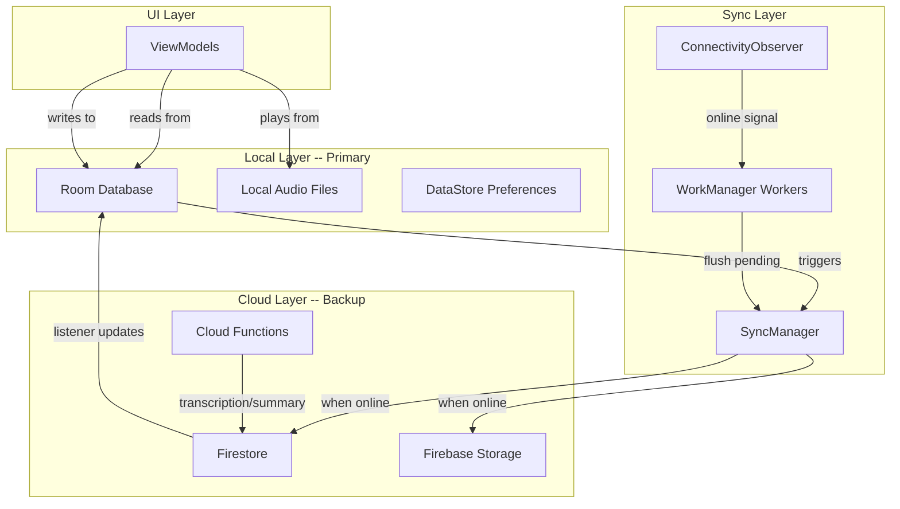

# Local-First Architecture Migration

## Current State

The app is 100% Firebase-dependent for reads:

- **Audio playback**: Streams from Firebase Storage URL every time via `MediaPlayer.setDataSource(url)` -- no local copy kept after recording
- **Transcripts/summaries/tasks/folders**: Read from Firestore snapshot listeners -- no Room DB, no local SQL
- **Only local data**: DataStore for UI preferences, in-memory `RecordingStateRepository` for active recording state
- **No connectivity monitoring**: No `ConnectivityManager` or network state observer exists

Key files that will change:

- [AppModule.kt](android/app/src/main/java/com/voicemind/di/AppModule.kt) -- DI module, needs Room + new singletons
- [RecordingRepository.kt](android/app/src/main/java/com/voicemind/data/repository/RecordingRepository.kt) -- Cloud-only, becomes local-first
- [ActionItemRepository.kt](android/app/src/main/java/com/voicemind/data/repository/ActionItemRepository.kt) -- Cloud-only, becomes local-first
- [FolderRepository.kt](android/app/src/main/java/com/voicemind/data/repository/FolderRepository.kt) -- Cloud-only, becomes local-first
- [CollectiveSummaryRepository.kt](android/app/src/main/java/com/voicemind/data/repository/CollectiveSummaryRepository.kt) -- Cloud-only, becomes local-first
- [RecordingService.kt](android/app/src/main/java/com/voicemind/service/RecordingService.kt) -- Deletes local file after upload, must keep it
- [StorageRepository.kt](android/app/src/main/java/com/voicemind/data/repository/StorageRepository.kt) -- Upload-only, needs download support
- All ViewModels that call `getDownloadUrl()` for playback

## Target Architecture




## Data Flow Changes

**Recording (online):**

1. Record audio to `cacheDir` (unchanged)
2. Move audio to permanent local storage (`filesDir/audio/{id}.m4a`) -- NEW
3. Insert into Room with `syncStatus = PENDING_UPLOAD` -- NEW
4. Upload to Firebase Storage (background)
5. Update Room `syncStatus = SYNCED`
6. Call `processRecording` cloud function
7. Firestore listener receives transcription/summary update -> writes to Room

**Recording (offline):**

1. Record audio to `cacheDir`
2. Move to permanent local storage
3. Insert into Room with `syncStatus = PENDING_UPLOAD`
4. Show "pending processing" indicator in UI -- NEW
5. When connectivity returns, WorkManager triggers upload + processing
6. Firestore listener receives results -> Room

**Playback:**

- Own recordings: `MediaPlayer.setDataSource(localFilePath)` -- no network
- Shared recordings: Download once to `filesDir/shared_audio/`, then play locally

**Delete:**

- Local: Hard delete from Room + delete audio file from disk
- Cloud: Soft delete (`isDeleted = true`) via Firestore -- existing pattern

---

## Phase 1: Foundation -- Room DB, Local Audio, Connectivity

**Goal:** Set up all infrastructure without changing existing app behavior. Everything compiles and existing tests pass.

**Dependencies to add** ([libs.versions.toml](android/gradle/libs.versions.toml) + [build.gradle.kts](android/app/build.gradle.kts)):

- `androidx.room:room-runtime`, `room-ktx`, `room-compiler` (KSP)
- `androidx.work:work-runtime-ktx` (WorkManager for background sync)

**New files to create:**

- `data/local/entity/` -- Room entities
  - `RecordingEntity.kt` -- mirrors `Recording` model + `localAudioPath: String?`, `syncStatus: SyncStatus`
  - `ActionItemEntity.kt` -- mirrors `ActionItem` + `syncStatus`
  - `FolderEntity.kt` -- mirrors `Folder` + `syncStatus`
  - `CollectiveSummaryEntity.kt` -- mirrors `CollectiveSummary` + `syncStatus`
- `data/local/dao/` -- Room DAOs
  - `RecordingDao.kt` -- insert, update, delete, observe (Flow), query by folder, query pending sync
  - `ActionItemDao.kt` -- insert, update, delete, observe, query by recording
  - `FolderDao.kt` -- insert, update, delete, observe
  - `CollectiveSummaryDao.kt` -- insert, update, delete, observe
- `data/local/AppDatabase.kt` -- Room database class
- `data/local/SyncStatus.kt` -- enum: `SYNCED`, `PENDING_UPLOAD`, `PENDING_UPDATE`, `PENDING_DELETE`
- `data/local/LocalAudioManager.kt` -- manages audio files in `filesDir/audio/` and `filesDir/shared_audio/`
- `util/ConnectivityObserver.kt` -- wraps `ConnectivityManager.NetworkCallback`, exposes `Flow<Boolean>` for online state

**Modify:**

- [AppModule.kt](android/app/src/main/java/com/voicemind/di/AppModule.kt) -- provide `AppDatabase`, DAOs, `LocalAudioManager`, `ConnectivityObserver`

**SyncStatus enum:**

```kotlin
enum class SyncStatus {
    SYNCED,
    PENDING_UPLOAD,
    PENDING_UPDATE,
    PENDING_DELETE
}
```

**Room entity example (RecordingEntity):**

```kotlin
@Entity(tableName = "recordings")
data class RecordingEntity(
    @PrimaryKey val id: String,
    val title: String,
    val folderId: String,
    val createdAt: Long?,       // epoch millis (Timestamp -> Long converter)
    val transcription: String?,
    val summary: String?,
    val audioPath: String,      // cloud path
    val localAudioPath: String?, // local file path
    val durationSeconds: Long,
    val isDeleted: Boolean,
    val deletedAt: Long?,
    val processingFailed: Boolean,
    val syncStatus: SyncStatus,
)
```

---

## Phase 2: Recordings -- Local-First

**Goal:** Recordings are stored/read locally. Audio plays from local file. Offline recording works with deferred upload.

**Modify:**

- [RecordingService.kt](android/app/src/main/java/com/voicemind/service/RecordingService.kt):
  - After recording stops, move file from `cacheDir` to `LocalAudioManager.saveAudio(recordingId, file)` instead of deleting
  - Insert into Room via DAO with `syncStatus = PENDING_UPLOAD`
  - If online: upload to Storage + create Firestore doc + call `processRecording`
  - If offline: just save locally, WorkManager will sync later
- [RecordingRepository.kt](android/app/src/main/java/com/voicemind/data/repository/RecordingRepository.kt):
  - `observeRecordings()` reads from Room DAO (`Flow<List<RecordingEntity>>`) instead of Firestore snapshot
  - Keep Firestore snapshot listener **running in background** to sync cloud updates (transcription, summary, title from `processRecording`) into Room
  - `createRecording()` writes to Room first, then Firestore
  - `deleteRecording()` hard-deletes from Room + deletes local audio file; soft-deletes in Firestore
  - `updateTitle()`, `moveToFolder()` update Room first, then Firestore
  - `generateSummary()` still calls cloud function; result synced to Room via Firestore listener
- [RecordingsViewModel.kt](android/app/src/main/java/com/voicemind/ui/recording/RecordingsViewModel.kt):
  - `playAudio()` uses `MediaPlayer.setDataSource(localAudioPath)` instead of `getDownloadUrl()`
  - Waveform extraction uses local file path
- [RecordingDetailViewModel.kt](android/app/src/main/java/com/voicemind/ui/recording/RecordingDetailViewModel.kt):
  - Same playback change
- **New: `SyncWorker.kt`** (WorkManager `CoroutineWorker`):
  - Queries Room for `PENDING_UPLOAD` / `PENDING_UPDATE` items
  - Uploads audio to Storage, creates/updates Firestore docs
  - Updates Room `syncStatus = SYNCED` on success
  - Enqueued by `ConnectivityObserver` when device comes online
- **New: `FirestoreSyncService.kt`**:
  - Singleton that maintains Firestore snapshot listeners for the user's collections
  - On snapshot change, upserts into Room (but only for fields the cloud owns: `transcription`, `summary`, `processingFailed`)
  - Handles conflict: cloud-owned fields always win; user-edited fields (title, folder) use "last write wins"

---

## Phase 3: Action Items, Folders, Collective Summaries -- Local-First

**Goal:** All remaining data types read from Room. Same pattern as Phase 2.

**Modify:**

- [ActionItemRepository.kt](android/app/src/main/java/com/voicemind/data/repository/ActionItemRepository.kt):
  - `observeActionItems()`, `observeByRecordingId()`, `observeActionItem()` read from Room
  - `createItem()`, `toggleCompleted()`, `updateTitle()`, `updateDueDate()` etc. write to Room first + Firestore
  - `deleteItem()` hard-deletes Room, soft-deletes Firestore
  - Firestore listener syncs cloud changes (Google Tasks sync results, shared tasks) into Room
- [FolderRepository.kt](android/app/src/main/java/com/voicemind/data/repository/FolderRepository.kt):
  - Same pattern: Room primary, Firestore sync
- [CollectiveSummaryRepository.kt](android/app/src/main/java/com/voicemind/data/repository/CollectiveSummaryRepository.kt):
  - `generateCollectiveSummary()` still calls cloud function
  - Results synced to Room via Firestore listener
  - Reads from Room

---

## Phase 4: Offline UX + Delete Behavior

**Goal:** Clear user-facing indicators for offline state and pending processing. Delete asymmetry fully implemented.

**New UI elements:**

- **Offline banner**: Show a subtle banner/indicator when the device is offline
- **Pending processing badge**: On recordings that haven't been transcribed yet (recorded offline), show a "Waiting for internet" or "Processing pending" state
- **"Needs internet" dialogs**: When user tries to generate summary or extract tasks on an unprocessed recording while offline, show a dialog explaining they need to connect at least once
- **Sync status indicator**: Optional subtle indicator showing sync status (e.g. in settings or recording detail)

**Delete behavior:**

- All delete operations already soft-delete in Firestore (existing)
- Add hard delete from Room in parallel
- `LocalAudioManager.deleteAudio(recordingId)` to remove audio file from disk
- For offline deletes: mark `syncStatus = PENDING_DELETE` in Room, sync soft-delete to Firestore when online, then remove from Room

---

## Phase 5: Shared Content + New Device Setup

**Goal:** Shared recordings download locally. New device setup lets user choose sync strategy.

**Shared content:**

- When user opens a shared recording, download audio via `getSharedAudioUrl` to `filesDir/shared_audio/{shareId}.m4a`
- Play from local file on subsequent plays
- Store shared item metadata in Room (new `SharedItemEntity`, `SharedRecordingEntity`)
- Shared audio cleanup: delete local shared audio when user dismisses the shared item

**New device / reinstall setup:**

- On first launch (no Room data + user is authenticated), show a one-time setup dialog
- Options:
  - "Download everything" -- bulk download all recordings, audio files, tasks, folders from Firestore/Storage
  - "Download on demand" -- sync metadata only, download audio when user first plays a recording
  - "Metadata only" -- sync metadata, stream audio (legacy behavior for that recording)
- Store choice in DataStore (via `NavPreferenceRepository`), cannot be changed without reinstall
- Implement bulk sync worker that runs once on setup

---

## Phase 6: Storage Management + Permissions

**Goal:** User has visibility and control over local storage usage.

- **Storage permission**: On API 28 (minSdk), app-specific internal storage doesn't need runtime permission. If using external storage, request `MANAGE_EXTERNAL_STORAGE` or scoped storage. Recommend staying with `filesDir` (internal, no permission needed).
- **Storage usage screen** (in Settings):
  - Total local storage used
  - Breakdown: own audio, shared audio, database
  - "Clear shared audio cache" button
  - "Clear all local data" (re-triggers new-device setup flow)
- **User consent dialog**: On first app launch or upgrade to this version, inform user that the app will now store data locally for better performance, show estimated storage usage, and let them opt-in

---

## Risk Considerations

- **Room schema migrations**: Each phase that adds entities needs a proper migration strategy. Use `fallbackToDestructiveMigration()` during development, proper `Migration` objects for production
- **Firestore listener + Room writes**: Must handle threading carefully -- Firestore callbacks on main thread, Room writes on IO dispatcher
- **Conflict resolution**: Cloud-owned fields (transcription, summary, processingFailed) always take cloud value. User-owned fields (title, folderId, notes) use timestamp-based "last write wins"
- **Storage growth**: Audio files can be large. Need to monitor and surface storage usage to users
- **First-time sync**: Downloading all audio for a heavy user could be 1GB+. The on-demand option is important

