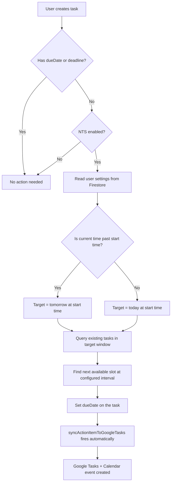

# Natural Time Selection Feature

## Architecture Overview

All tasks live in Firestore `users/{uid}/actionItems`. There are two creation paths: **server-side** (Cloud Functions: `processRecording`, `retryExtractActionItems`) and **client-side** (`ActionItemRepository.createItem`). Both write to the same collection. Since there is **no reverse sync** from Google Tasks/Calendar into Firestore, every document in `actionItems` is app-created by definition -- no special tagging is needed for conflict detection.

The feature will be implemented as a **new Firestore Cloud Function trigger** (`onDocumentCreated`) that intercepts newly created tasks, checks if they lack a date, reads user settings, and auto-assigns a `dueDate`. This covers both creation paths without modifying existing creation logic.

## Key Insight: No Tagging Needed

The user asked about identifying app-created tasks vs external calendar events. Since the `actionItems` Firestore collection **only** contains app-created tasks (sync is one-way: Firestore to Google), we just query this collection for occupied time slots -- no `extendedProperties` or source flags are required.

## Changes by File

### 1. Firestore User Document Schema -- new fields on `users/{uid}`

Add these fields (written from Android Settings UI, read by Cloud Function):

- `ntsEnabled: boolean` -- master toggle (default: `false`)
- `ntsStartHour: number` -- hour in 24h format (default: `22` for 10 PM)
- `ntsStartMinute: number` -- minute (default: `0`)
- `ntsIntervalMinutes: number` -- gap between sequential tasks (default: `30`)
- `timezone: string` -- IANA timezone ID (needed by Cloud Function; currently only in DataStore)

### 2. New Cloud Function: `autoScheduleActionItem`

**File:** [functions/src/index.ts](functions/src/index.ts)

- Trigger: `onDocumentCreated("users/{uid}/actionItems/{itemId}")`
- Logic:
  1. Read the new document. If `dueDate` or `deadline` is already set, return early.
  2. Read `users/{uid}` for NTS settings. If `ntsEnabled !== true`, return early.
  3. Determine target date: if current time (in user's timezone) is past `ntsStartHour:ntsStartMinute`, target = tomorrow; else target = today.
  4. Query `actionItems` where `dueDate` falls within the target date's scheduling window (from start time to midnight + buffer).
  5. Collect occupied slots, calculate the first available slot at `ntsIntervalMinutes` intervals.
  6. If all slots up to midnight are full, roll to next day at start time.
  7. Write `dueDate` as a Firestore `Timestamp` on the document.
  8. This write triggers the existing `syncActionItemToGoogleTasks`, which creates the Google Task and Calendar event.

### 3. Android Settings UI

**File:** [android/app/src/main/java/com/voicemind/ui/settings/SettingsScreen.kt](android/app/src/main/java/com/voicemind/ui/settings/SettingsScreen.kt)

- Add a new `SettingsSectionHeader("TASK SCHEDULING")` section between "DATE & TIME" and "INTEGRATIONS".
- Contains:
  - **Toggle**: "Natural Time Selection" with subtitle explaining the feature
  - **Time Picker**: "Default start time" (shows current value like "10:00 PM"), tappable to open a Material3 `TimePicker` dialog. Only visible when toggle is on.
  - **Interval Picker**: "Interval between tasks" as a dropdown/segmented button with options like 15, 30, 45, 60 min. Only visible when toggle is on.

### 4. Android Settings ViewModel

**File:** [android/app/src/main/java/com/voicemind/ui/settings/SettingsViewModel.kt](android/app/src/main/java/com/voicemind/ui/settings/SettingsViewModel.kt)

- Add `StateFlow` properties for `ntsEnabled`, `ntsStartHour`, `ntsStartMinute`, `ntsIntervalMinutes` read from Firestore `users/{uid}` via snapshot listener.
- Add setter methods that write to Firestore `users/{uid}`.
- When the user changes timezone in settings, also write `timezone` to Firestore `users/{uid}` (currently only saved to DataStore).

### 5. Android Repository

**File:** [android/app/src/main/java/com/voicemind/data/repository/NavPreferenceRepository.kt](android/app/src/main/java/com/voicemind/data/repository/NavPreferenceRepository.kt) (timezone sync)

- When `setTimezone()` is called, also update `timezone` on the Firestore `users/{uid}` document.

Alternatively, create a small `NtsSettingsRepository` or add NTS methods to an existing repository that has Firestore access (like `GoogleTasksRepository` which already reads/writes the user doc). This is cleaner since `NavPreferenceRepository` currently only uses DataStore and doesn't have a Firestore dependency.

**Recommended:** Add NTS settings read/write methods to a new or existing Firestore-backed repository (e.g., extend `GoogleTasksRepository` or create `UserSettingsRepository`).

### 6. ActionItem Model -- optional enhancement

**File:** [android/app/src/main/java/com/voicemind/data/model/ActionItem.kt](android/app/src/main/java/com/voicemind/data/model/ActionItem.kt)

- Optionally add `autoScheduled: Boolean = false` field so the UI can show an "Auto-scheduled" indicator and users can distinguish manually set dates from NTS-assigned ones.

## Edge Cases to Handle

- **All slots full until midnight**: roll to next day at start time and repeat the search.
- **Race condition** (two tasks created simultaneously): use Firestore transactions or simply accept that two tasks may briefly share a slot; the 30-min interval makes collisions unlikely.
- **User disables NTS after tasks were auto-scheduled**: already-assigned `dueDate` values persist; only new tasks are affected.
- **User manually changes the `dueDate` after auto-scheduling**: no conflict -- the user's explicit choice wins; the `autoScheduleActionItem` trigger only fires `onDocumentCreated`, not on updates.
- **Timezone not yet set on user doc**: fall back to UTC or skip NTS for that task (log a warning).
