# Phase 10: Collective Summary Sharing

## Current State

- **Backend**: `shareItem` in [functions/src/sharing.ts](functions/src/sharing.ts) already handles `itemType: "collectiveSummary"` via `getItemCollection()`. No deletion cascade trigger exists.
- **Firestore Rules**: [firestore.rules](firestore.rules) already allows cross-user reads on `collectiveSummaries/{summaryId}` when `auth.uid in resource.data.sharedWith` (line 13-16).
- **Model**: [CollectiveSummary.kt](android/app/src/main/java/com/voicemind/data/model/CollectiveSummary.kt) lacks `sharedWith` field.
- **SummariesScreen**: [SummariesScreen.kt](android/app/src/main/java/com/voicemind/ui/summaries/SummariesScreen.kt) has a `SummaryDetailSheet` with Copy / OS-Share / Delete — no in-app user sharing.
- **SharedItemsScreen**: Summaries tab shows hardcoded "Collective Summary" title, and `onClick = { }` is a no-op (no detail view, no navigation route).
- **Repository**: [CollectiveSummaryRepository.kt](android/app/src/main/java/com/voicemind/data/repository/CollectiveSummaryRepository.kt) has no cross-user read or duplication methods.

## Architecture

```mermaid
flowchart TD
    subgraph owner [Owner Flow]
        SS["SummariesScreen"]
        SS -->|"tap PersonAdd"| SD["ShareDialog itemType=collectiveSummary"]
        SD -->|"calls"| SI["shareItem callable"]
        SI -->|"writes"| FD["sharedWithMe + myShares + sharedWith field"]
    end
    subgraph recipient [Recipient Flow]
        SIS["SharedItemsScreen Summaries tab"]
        SIS -->|"tap row"| SSDS["SharedSummaryDetailScreen"]
        SSDS -->|"read-only view"| OBS["observeSharedSummary"]
        SSDS -->|"Duplicate action"| DUP["duplicateSharedSummary"]
    end
    subgraph cascade [Deletion Cascade]
        DEL["Owner deletes summary"]
        DEL --> TRIGGER["onCollectiveSummaryDeleted trigger"]
        TRIGGER --> CLEAN["Delete myShares + sharedWithMe entries"]
    end
```

## Implementation Steps

### 1. Model Update — `CollectiveSummary.kt`

Add `sharedWith: List<String> = emptyList()` to match the Firestore schema (field is written by `shareItem`).

### 2. Backend — `onCollectiveSummaryDeleted` trigger in `sharing.ts`

Mirror `onRecordingDeleted` (line 456-499). Trigger path: `users/{uid}/collectiveSummaries/{summaryId}`. On delete: read `sharedWith`, query `myShares` for `itemId == summaryId && itemType == "collectiveSummary"`, batch-delete `myShares` + corresponding `sharedWithMe` entries. Uses the same 250-per-batch pattern.

### 3. Repository — `CollectiveSummaryRepository.kt`

Add two methods:

- `getSharedSummary(ownerUid, summaryId)` — one-shot Firestore read from `users/{ownerUid}/collectiveSummaries/{summaryId}` (mirrors `RecordingRepository.getSharedRecording`)
- `observeSharedSummary(ownerUid, summaryId)` — real-time snapshot listener on the same path
- `duplicateSharedSummary(ownerUid, summaryId)` — reads the shared doc, writes a copy to the user's own collection with fresh `createdAt`, keeps `recordingTitles` for context, clears `recordingIds` (they reference the owner's recordings)

### 4. Repository — `SharingRepository.kt`

Rename `getSharedItemForRecording(itemId)` to `getSharedItem(itemId)` since it is generic (just queries `sharedWithMe` by `itemId`). Update the single caller in `SharedRecordingDetailViewModel.kt`.

### 5. SummariesScreen — Add "Share with User" action

In [SummariesScreen.kt](android/app/src/main/java/com/voicemind/ui/summaries/SummariesScreen.kt):

- Add `var showShareDialog` state
- Add `PersonAdd` icon button to the action row in `SummaryDetailSheet` (alongside existing Copy/Share/Delete)
- Make `SummaryDetailSheet` accept an `onShareWithUser` callback
- Render `ShareDialog(itemId = summary.id, itemType = "collectiveSummary")` when triggered

### 6. SharedItemsViewModel — Fetch real summary preview

In [SharedItemsViewModel.kt](android/app/src/main/java/com/voicemind/ui/sharing/SharedItemsViewModel.kt):

- Inject `CollectiveSummaryRepository`
- In the enrichment block, for `"collectiveSummary"` items, call `collectiveSummaryRepository.getSharedSummary(item.ownerUid, item.itemId)` and extract the first non-blank line (stripped of markdown headers), truncated to ~60 chars, as the title

### 7. SharedItemsScreen — Wire `onSummaryClick`

In [SharedItemsScreen.kt](android/app/src/main/java/com/voicemind/ui/sharing/SharedItemsScreen.kt):

- Add `onSummaryClick: (ownerUid: String, summaryId: String) -> Unit = { _, _ -> }` parameter
- In the Summaries tab, change `onClick = { }` to `onClick = { onSummaryClick(item.ownerUid, item.itemId) }`

### 8. Navigation — New route + composable

In [Routes.kt](android/app/src/main/java/com/voicemind/ui/navigation/Routes.kt):

- Add `SHARED_SUMMARY_DETAIL_ROUTE = "shared_summary/{ownerUid}/{summaryId}"`
- Add `fun sharedSummaryDetailRoute(ownerUid, summaryId)`

In [AppNavHost.kt](android/app/src/main/java/com/voicemind/ui/navigation/AppNavHost.kt):

- Add `composable(SHARED_SUMMARY_DETAIL_ROUTE)` block
- Pass `onSummaryClick` to `SharedItemsScreen` wired to `navController.navigate(sharedSummaryDetailRoute(...))`

### 9. SharedSummaryDetailScreen (new file)

`android/app/src/main/java/com/voicemind/ui/sharing/SharedSummaryDetailScreen.kt`

Full-screen Scaffold:

- **TopAppBar**: Summary title (first line) + "Shared by [name]" subtitle
- **Overflow menu**: "Duplicate" (copies to own collection) + "Copy" (clipboard)
- **Body**: Summary text rendered via `RichText { Markdown(...) }` (same library used in `SummariesScreen`)
- **Sources section**: List of recording titles
- **SnackbarHost**: For "Duplicated successfully" feedback
- **Error/loading states**: Consistent with `SharedRecordingDetailScreen` patterns

### 10. SharedSummaryDetailViewModel (new file)

`android/app/src/main/java/com/voicemind/ui/sharing/SharedSummaryDetailViewModel.kt`

- Injects `CollectiveSummaryRepository`, `SharingRepository`
- Reads `ownerUid` and `summaryId` from `SavedStateHandle`
- Observes summary via `collectiveSummaryRepository.observeSharedSummary(ownerUid, summaryId)`
- Fetches owner name via `sharingRepository.getSharedItem(summaryId)`
- `duplicateSummary()` calls `collectiveSummaryRepository.duplicateSharedSummary()`, sets success state
- UI state: `summary`, `ownerName`, `isLoading`, `error`, `isDuplicating`, `duplicateSuccess`

## User Action Items

After implementation:

- **Deploy Cloud Functions** — The new `onCollectiveSummaryDeleted` trigger must be deployed to Firebase
- **Build verification** — Run `./gradlew compileDebugKotlin` from `android/` directory
- **Manual testing** — Verify all 6 items under Phase 10 Verification in `sharingphases.md`:
  - Sharing a collective summary creates inbox/outbox entries
  - Recipient sees summary in Shared Items > Summaries tab
  - Summary is read-only for recipient
  - Recipient does NOT automatically get access to underlying recordings
  - Owner deleting summary removes it from all recipients
  - Duplicated summary is fully independent

