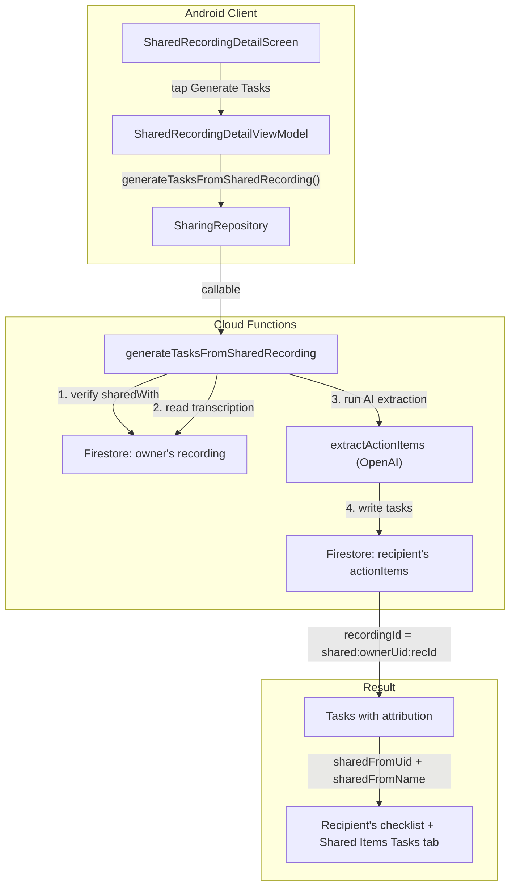

# Phase 11: Generate Tasks from Shared Recordings

## Problem

Recipients who view a shared recording can see the owner's tasks but cannot generate their own personalized tasks from the transcription. Phase 11 adds a Cloud Function that reuses the existing `extractActionItems` AI pipeline and writes generated tasks to the recipient's own `actionItems` collection.

## Architecture




## Implementation

### 1. Export `extractActionItems` from transcription.ts

**File:** [functions/src/transcription.ts](functions/src/transcription.ts) (line 182)

`extractActionItems` is currently module-private. Add the `export` keyword so `sharing.ts` can import it:

```typescript
// Before:
async function extractActionItems(
// After:
export async function extractActionItems(
```

No callers change — existing internal calls still work.

### 2. Extend `buildAndCommitActionItems` with optional extra fields

**File:** [functions/src/lib/firestore.ts](functions/src/lib/firestore.ts) (line 26)

Add an optional `extraFields` parameter to avoid duplicating the batch-write logic:

```typescript
export async function buildAndCommitActionItems(
  uid: string,
  recordingId: string,
  items: ExtractedActionItem[],
  tz: string,
  extraFields?: Record<string, unknown>,  // NEW
): Promise<void> {
  // ... existing logic ...
  // After building each doc, spread extraFields:
  if (extraFields) Object.assign(doc, extraFields);
  batch.set(docRef, doc);
}
```

Existing callers (`processRecording`, `retryExtractActionItems`) pass no `extraFields` — fully backwards-compatible.

### 3. Create `generateTasksFromSharedRecording` callable

**File:** [functions/src/sharing.ts](functions/src/sharing.ts) (append after `onRecordingDeleted`)

New imports needed at top:

- `import { extractActionItems } from "./transcription.js";`
- `import { buildAndCommitActionItems } from "./lib/firestore.js";`
- `import { openaiApiKey } from "./lib/config.js";`

Callable structure (mirrors `duplicateSharedRecording` pattern):

- **Config:** `onCall({ secrets: [openaiApiKey], timeoutSeconds: 120 }, ...)`
- **Auth check:** standard `if (!request.auth)` guard
- **Input validation:** `{ ownerUid, recordingId, timezone? }` — require `ownerUid` and `recordingId`
- **Read recording:** `users/{ownerUid}/recordings/{recordingId}` — 404 if not found
- **Verify access:** check `callerUid in sharedWith` array
- **Read transcription:** error `"invalid-argument"` if transcription is empty/missing
- **Duplicate guard:** query `users/{callerUid}/actionItems` where `recordingId == "shared:{ownerUid}:{recordingId}"`, limit 1 — if exists, return `{ success: true, count: 0, alreadyGenerated: true }`
- **Extract:** `await extractActionItems(transcription, tz || "UTC")`
- **Write:** `await buildAndCommitActionItems(callerUid, "shared:{ownerUid}:{recordingId}", items, tz, { sharedFromUid: ownerUid, sharedFromName: ownerName })`
- **Return:** `{ success: true, count: items.length }`

The `shared:{ownerUid}:{recordingId}` format for `recordingId` distinguishes generated tasks from locally-recorded ones and enables the duplicate guard query.

### 4. Add `hasGeneratedTasksForSharedRecording` to ActionItemRepository

**File:** [android/.../data/repository/ActionItemRepository.kt](android/app/src/main/java/com/voicemind/data/repository/ActionItemRepository.kt)

```kotlin
suspend fun hasGeneratedTasksForSharedRecording(ownerUid: String, recordingId: String): Boolean {
    return collection()
        .whereEqualTo("recordingId", "shared:$ownerUid:$recordingId")
        .limit(1)
        .get().await()
        .documents.isNotEmpty()
}
```

### 5. Add `generateTasksFromSharedRecording` to SharingRepository

**File:** [android/.../data/repository/SharingRepository.kt](android/app/src/main/java/com/voicemind/data/repository/SharingRepository.kt)

```kotlin
suspend fun generateTasksFromSharedRecording(
    ownerUid: String, recordingId: String, timezone: String
): Int {
    val result = functions
        .getHttpsCallable("generateTasksFromSharedRecording")
        .call(hashMapOf("ownerUid" to ownerUid, "recordingId" to recordingId, "timezone" to timezone))
        .await()
    @Suppress("UNCHECKED_CAST")
    val data = result.getData() as? Map<*, *> ?: return 0
    return when (val raw = data["count"]) {
        is Long -> raw.toInt(); is Double -> raw.toInt(); is Int -> raw; else -> 0
    }
}
```

Pattern matches existing `retryExtractActionItems` in `ActionItemRepository` (line 112-123).

### 6. Update SharedRecordingDetailViewModel

**File:** [android/.../ui/sharing/SharedRecordingDetailViewModel.kt](android/app/src/main/java/com/voicemind/ui/sharing/SharedRecordingDetailViewModel.kt)

Add to `SharedRecordingDetailUiState`:

- `isGeneratingTasks: Boolean = false`
- `generatedTaskCount: Int? = null` (snackbar trigger; null = not shown)
- `hasGeneratedTasks: Boolean = false` (hides button after generation or if already generated)

Add init check (in the existing IO launch block):

- Call `actionItemRepository.hasGeneratedTasksForSharedRecording(ownerUid, recordingId)`
- Update `hasGeneratedTasks` in state

Add `generateTasks()` action:

- Set `isGeneratingTasks = true`
- Call `sharingRepository.generateTasksFromSharedRecording(ownerUid, recordingId, TimeZone.getDefault().id)`
- On success: set `hasGeneratedTasks = true`, `generatedTaskCount = count`, `isGeneratingTasks = false`
- On failure: set `error = "Failed to generate tasks"`, `isGeneratingTasks = false`

Add `clearGeneratedTaskCount()` to reset snackbar trigger.

### 7. Update SharedRecordingDetailScreen

**File:** [android/.../ui/sharing/SharedRecordingDetailScreen.kt](android/app/src/main/java/com/voicemind/ui/sharing/SharedRecordingDetailScreen.kt)

Add a "Generate Tasks" button below the `SharedTasksCard` (after the existing Tasks section, around line 330):

- Visible only when `recording.transcription != null && !state.hasGeneratedTasks`
- Shows `CircularProgressIndicator` when `state.isGeneratingTasks`
- Uses a `FilledTonalButton` (consistent with app style) with appropriate text
- Disabled while generating

Add `LaunchedEffect` for `state.generatedTaskCount` to show snackbar: "Generated N tasks" and call `viewModel.clearGeneratedTaskCount()`.

## Key Design Decisions

- **Reuses `extractActionItems` pipeline** — no duplicated AI prompt logic; same OpenAI schema, same date resolution, same quality
- `**buildAndCommitActionItems` extended with `extraFields`** — DRY approach; the `sharedFromUid`/`sharedFromName` attribution and the special `recordingId` format are passed as extra fields
- **Duplicate guard is both server-side and client-side** — Cloud Function queries for existing tasks before calling OpenAI (avoids wasting API credits); client hides the button if tasks already exist
- `**recordingId = "shared:{ownerUid}:{recordingId}"`** — enables clean querying for the duplicate guard and distinguishes generated tasks from organic ones
- **Tasks appear in both the normal checklist and Shared Items > Tasks tab** because they have `sharedFromUid` set (same as Phase 9's independently shared tasks)

## User Action Items

After implementation:

1. **Deploy Cloud Functions** — Run `firebase deploy --only functions` from the project root. This deploys:
  - The new `generateTasksFromSharedRecording` callable
  - The `extractActionItems` export change in `transcription.ts`
  - Both must be deployed together since the callable imports from transcription
2. **Verify OpenAI secret** — The `OPENAI_API_KEY` secret must be configured in Firebase (it should already be, since `processRecording` uses it). No action needed unless it was removed.
3. **Build and test** — Run `./gradlew compileDebugKotlin` from `android/` to verify the Android build compiles
4. **Manual testing checklist** (from sharingphases.md verification):
  - Share a recording with another user, open it as recipient, tap "Generate Tasks"
  - Verify tasks appear in recipient's normal checklist AND in Shared Items > Tasks tab
  - Verify tasks have "Shared by [name]" attribution in TaskDetailScreen
  - Verify tapping "Generate Tasks" a second time is blocked (button hidden)
  - Verify tasks generated from a recording with no transcription: button should not appear

