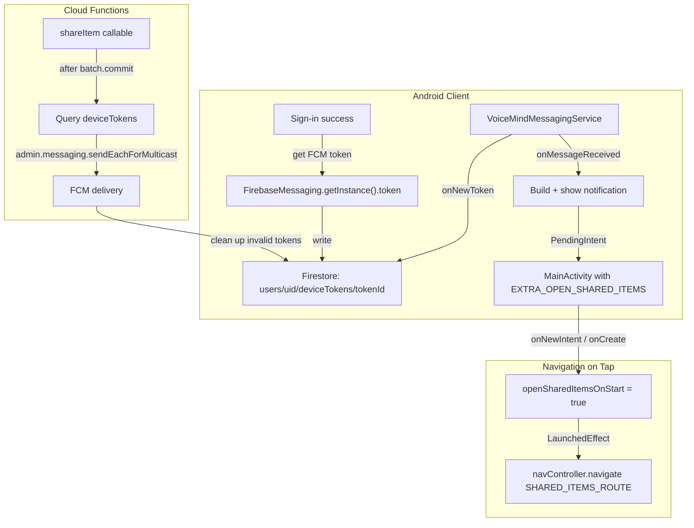

# Phase 12: Push Notifications

## Current State

- **No FCM dependency** in the project. [libs.versions.toml](android/gradle/libs.versions.toml) has Firebase BOM (`33.7.0`) but no `firebase-messaging` entry.
- `**POST_NOTIFICATIONS` permission** is already declared in [AndroidManifest.xml](android/app/src/main/AndroidManifest.xml) and requested at runtime in [MainActivity.kt](android/app/src/main/java/com/voicemind/MainActivity.kt).
- **No messaging service** class exists anywhere in the project.
- **No `deviceTokens` collection** is written to or read from by any code.
- **Backend** `firebase-admin` (`^13.6.0`) already supports `admin.messaging()` -- no new npm dependency needed.
- **Existing notification-tap pattern**: `MainActivity` reads intent extras (e.g. `EXTRA_OPEN_RECORDINGS`) in `onCreate`/`onNewIntent` and passes flags to `AppNavHost`, which uses `LaunchedEffect` to navigate. This is the pattern to mirror for "open Shared Items on tap".

## Architecture




## Implementation

### 1. Add Firebase Messaging dependency

**File:** [android/gradle/libs.versions.toml](android/gradle/libs.versions.toml)

Add under `# Firebase` libraries section (line 54):

```toml
firebase-messaging-ktx = { group = "com.google.firebase", name = "firebase-messaging-ktx" }
```

No version needed -- it inherits from the Firebase BOM.

**File:** [android/app/build.gradle.kts](android/app/build.gradle.kts)

Add alongside existing Firebase deps (around line 120):

```kotlin
implementation(libs.firebase.messaging.ktx)
```

### 2. Create notification channel

**File:** [android/app/src/main/java/com/voicemind/VoiceMindApp.kt](android/app/src/main/java/com/voicemind/VoiceMindApp.kt)

In `onCreate()`, create a notification channel for shared items:

```kotlin
if (Build.VERSION.SDK_INT >= Build.VERSION_CODES.O) {
    val channel = NotificationChannel(
        "shared_items",
        "Shared Items",
        NotificationManager.IMPORTANCE_HIGH,
    ).apply {
        description = "Notifications when someone shares items with you"
    }
    getSystemService(NotificationManager::class.java).createNotificationChannel(channel)
}
```

This is safe to call repeatedly (Android no-ops if channel already exists). The app already targets min SDK 28, so the `Build.VERSION` check is technically always true but is good practice.

### 3. Create VoiceMindMessagingService

**New file:** `android/app/src/main/java/com/voicemind/service/VoiceMindMessagingService.kt`

```kotlin
@AndroidEntryPoint
class VoiceMindMessagingService : FirebaseMessagingService() {

    @Inject lateinit var firestore: FirebaseFirestore
    @Inject lateinit var authRepository: AuthRepository

    override fun onNewToken(token: String) {
        super.onNewToken(token)
        val uid = authRepository.currentUser?.uid ?: return
        firestore.collection("users/$uid/deviceTokens")
            .document(token.hashCode().toString())
            .set(mapOf("token" to token, "updatedAt" to FieldValue.serverTimestamp()))
    }

    override fun onMessageReceived(message: RemoteMessage) {
        super.onMessageReceived(message)
        val data = message.data
        val title = data["title"] ?: message.notification?.title ?: "New shared item"
        val body = data["body"] ?: message.notification?.body ?: ""

        val intent = Intent(this, MainActivity::class.java).apply {
            flags = Intent.FLAG_ACTIVITY_SINGLE_TOP or Intent.FLAG_ACTIVITY_CLEAR_TOP
            putExtra(MainActivity.EXTRA_OPEN_SHARED_ITEMS, true)
        }
        val pendingIntent = PendingIntent.getActivity(
            this, 0, intent,
            PendingIntent.FLAG_UPDATE_CURRENT or PendingIntent.FLAG_IMMUTABLE,
        )

        val notification = NotificationCompat.Builder(this, "shared_items")
            .setSmallIcon(R.drawable.ic_launcher_foreground)
            .setContentTitle(title)
            .setContentText(body)
            .setAutoCancel(true)
            .setContentIntent(pendingIntent)
            .build()

        val mgr = getSystemService(NotificationManager::class.java)
        mgr.notify(System.currentTimeMillis().toInt(), notification)
    }
}
```

Key decisions:

- Uses `@AndroidEntryPoint` for Hilt injection (Firestore + AuthRepository)
- Token doc ID is `token.hashCode().toString()` for stable upserts without storing the raw token as a document ID (FCM tokens can be very long)
- `onMessageReceived` handles **data messages** (sent by our Cloud Function) which arrive even when the app is in the foreground
- Notification channel ID matches `"shared_items"` created in step 2

### 4. Register service in AndroidManifest.xml

**File:** [android/app/src/main/AndroidManifest.xml](android/app/src/main/AndroidManifest.xml)

Add inside `<application>` (after existing services):

```xml
<service
    android:name=".service.VoiceMindMessagingService"
    android:exported="false">
    <intent-filter>
        <action android:name="com.google.firebase.MESSAGING_EVENT" />
    </intent-filter>
</service>
```

### 5. Register FCM token after sign-in

**File:** [android/app/src/main/java/com/voicemind/data/repository/AuthRepository.kt](android/app/src/main/java/com/voicemind/data/repository/AuthRepository.kt)

Add a method to register the current FCM token:

```kotlin
fun registerFcmToken() {
    val uid = currentUser?.uid ?: return
    FirebaseMessaging.getInstance().token.addOnSuccessListener { token ->
        firestore.collection("users/$uid/deviceTokens")
            .document(token.hashCode().toString())
            .set(mapOf("token" to token, "updatedAt" to FieldValue.serverTimestamp()))
            .addOnFailureListener { Timber.e(it, "Failed to register FCM token") }
    }
}
```

Call `registerFcmToken()` at the end of each successful sign-in method (`signInWithEmail`, `signUpWithEmail`, `signInWithGoogleCredential`) -- right after `syncProfileToFirestore(user)`.

Also call it from `MainActivity` on app start when already signed in (covers token refresh between sessions). Add to the `isSignedIn` branch in `setContent`:

```kotlin
LaunchedEffect(Unit) {
    authViewModel.registerFcmToken()
}
```

### 6. Handle notification tap navigation

**File:** [android/app/src/main/java/com/voicemind/MainActivity.kt](android/app/src/main/java/com/voicemind/MainActivity.kt)

Mirror the existing `openRecordingsOnStart` pattern:

- Add companion constant: `const val EXTRA_OPEN_SHARED_ITEMS = "extra_open_shared_items"`
- Add state: `private var openSharedItemsOnStart by mutableStateOf(false)`
- In `onCreate`: `openSharedItemsOnStart = intent?.getBooleanExtra(EXTRA_OPEN_SHARED_ITEMS, false) == true`
- In `onNewIntent`: add check for `EXTRA_OPEN_SHARED_ITEMS` and set `openSharedItemsOnStart = true`
- Pass `openSharedItemsOnStart` and `onSharedItemsOpened = { openSharedItemsOnStart = false }` to `AppNavHost`

**File:** [android/app/src/main/java/com/voicemind/ui/navigation/AppNavHost.kt](android/app/src/main/java/com/voicemind/ui/navigation/AppNavHost.kt)

- Add params: `openSharedItemsOnStart: Boolean = false`, `onSharedItemsOpened: () -> Unit = {}`
- Add `LaunchedEffect` (mirroring the recordings one):

```kotlin
LaunchedEffect(openSharedItemsOnStart) {
    if (openSharedItemsOnStart) {
        navController.navigate(SHARED_ITEMS_ROUTE)
        onSharedItemsOpened()
    }
}
```

### 7. Backend -- Send FCM from shareItem

**File:** [functions/src/sharing.ts](functions/src/sharing.ts)

After `await batch.commit()` (line 160) and before the `if (itemType === "recording")` block, add FCM notification logic:

```typescript
// Send push notification to recipient (fire-and-forget; do not block share)
try {
    const tokensSnap = await db.collection(`users/${recipientUid}/deviceTokens`).get();
    if (!tokensSnap.empty) {
        const tokens = tokensSnap.docs.map(d => (d.data() as { token: string }).token);
        const itemTitle = (itemDoc.data() as Record<string, unknown>).title as string
            || (itemDoc.data() as Record<string, unknown>).summary as string
            || "";
        const titlePreview = typeof itemTitle === "string"
            ? itemTitle.substring(0, 100)
            : "";
        const response = await admin.messaging().sendEachForMulticast({
            tokens,
            data: {
                title: `${callerData.displayName || "Someone"} shared a ${itemType === "collectiveSummary" ? "summary" : itemType} with you`,
                body: titlePreview,
                type: "shared_item",
                shareId,
                itemType: itemType!,
            },
        });
        // Clean up invalid tokens
        const invalidIndices = response.responses
            .map((r, i) => (!r.success && (
                r.error?.code === "messaging/invalid-registration-token" ||
                r.error?.code === "messaging/registration-token-not-registered"
            )) ? i : -1)
            .filter(i => i >= 0);
        if (invalidIndices.length > 0) {
            const cleanBatch = db.batch();
            invalidIndices.forEach(i => cleanBatch.delete(tokensSnap.docs[i].ref));
            await cleanBatch.commit();
        }
    }
} catch (fcmErr) {
    console.error("FCM notification failed (non-blocking):", fcmErr);
}
```

Key decisions:

- Uses **data-only messages** (no `notification` field) so `onMessageReceived` fires in foreground, background, and killed states
- Fire-and-forget: FCM failures do not affect the share operation or its return value
- Invalid/expired tokens are cleaned up automatically
- No new npm dependencies needed (`admin.messaging()` is built into `firebase-admin`)

### 8. Update sharingphases.md

Mark all Phase 12 items as `[x]` in [sharingphases.md](sharingphases.md).

## Files Changed Summary


| File                                                                           | Change                                               |
| ------------------------------------------------------------------------------ | ---------------------------------------------------- |
| `android/gradle/libs.versions.toml`                                            | Add `firebase-messaging-ktx` library entry           |
| `android/app/build.gradle.kts`                                                 | Add messaging dependency                             |
| `android/app/src/main/AndroidManifest.xml`                                     | Register `VoiceMindMessagingService`                 |
| `android/app/src/main/java/com/voicemind/VoiceMindApp.kt`                      | Create notification channel                          |
| `android/app/src/main/java/com/voicemind/service/VoiceMindMessagingService.kt` | **NEW** -- FCM service                               |
| `android/app/src/main/java/com/voicemind/data/repository/AuthRepository.kt`    | Add `registerFcmToken()` method + call after sign-in |
| `android/app/src/main/java/com/voicemind/MainActivity.kt`                      | Add `EXTRA_OPEN_SHARED_ITEMS` handling               |
| `android/app/src/main/java/com/voicemind/ui/navigation/AppNavHost.kt`          | Add shared items navigation on launch                |
| `functions/src/sharing.ts`                                                     | Add FCM send after `shareItem` batch commit          |


## User Action Items

1. **Deploy Cloud Functions** -- Run `firebase deploy --only functions` to deploy the updated `shareItem` with FCM sending
2. **Build and install** -- Run `./gradlew assembleDebug` and install on device (FCM does not work on most emulators without Google Play Services)
3. **Test with two accounts** -- Share an item from account A to account B; verify B receives a push notification; tap it and verify navigation to Shared Items screen
4. **Test notification permission denied** -- Deny notification permission on a device; verify the app still works normally (shares succeed, just no push)
5. **Test background/killed states** -- Verify notifications arrive when the app is in background and when it is killed (data messages should work in both cases)

