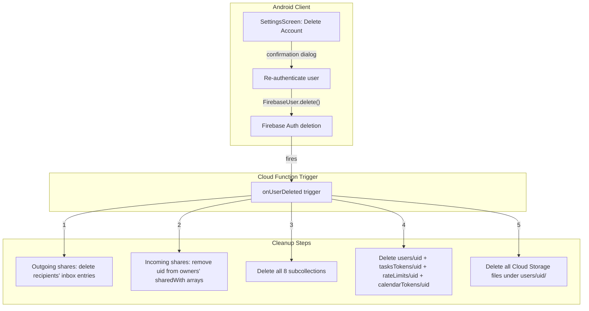

# Phase 13: Account Deletion and Final Cleanup

## Current State

- `**userProfile.ts**` has only `onUserCreated` (Gen 1 auth trigger). No deletion trigger exists.
- **No Android UI** for account deletion -- Settings only has "Sign Out".
- **Subcollections under `users/{uid}`**: `recordings`, `folders`, `actionItems`, `collectiveSummaries`, `sharedWithMe`, `myShares`, `ntsCounters`, `deviceTokens` (8 total).
- **Root-level per-user collections**: `tasksTokens/{uid}`, `calendarTokens/{uid}`, `rateLimits/{uid}`.
- **Cloud Storage**: files under `users/{uid}/audio/` prefix.
- Auth triggers use **Gen 1** API (`firebase-functions/v1`) since Gen 2 does not support auth triggers.

## Architecture




## Implementation

### 1. Create `onUserDeleted` trigger in userProfile.ts

**File:** [functions/src/userProfile.ts](functions/src/userProfile.ts)

Add imports for `admin` and `storage` from `./lib/firestore.js`. The trigger uses Gen 1 API (`functionsV1.auth.user().onDelete(...)`) matching the existing `onUserCreated` pattern.

The function runs 5 cleanup phases in order:

**Phase A -- Outgoing shares cleanup:**

- Query `users/{deletedUid}/myShares` (all docs)
- For each share entry, batch:
  - Delete `users/{recipientUid}/sharedWithMe/{shareId}` (inbox entry)
  - Delete the `myShares` doc itself
- Use 250-per-batch pattern (2 ops per share, staying under Firestore's 500-op batch limit)

**Phase B -- Incoming shares cleanup:**

- Query `users/{deletedUid}/sharedWithMe` (all docs)
- For each inbox entry, batch:
  - Remove `deletedUid` from the owner's item `sharedWith` array via `arrayRemove`
  - Delete the owner's `myShares/{shareId}` doc
  - Delete the `sharedWithMe` doc itself
- Use 166-per-batch (3 ops per share)

**Phase C -- Delete all subcollections:**

- Create a reusable helper `deleteCollection(collectionRef: CollectionReference)` that queries in chunks of 500 and batch-deletes
- Call it for each of the 8 subcollections: `recordings`, `folders`, `actionItems`, `collectiveSummaries`, `sharedWithMe`, `myShares`, `ntsCounters`, `deviceTokens`
- Note: `sharedWithMe` and `myShares` should already be empty after phases A/B, but delete defensively

**Phase D -- Delete root-level documents:**

- Delete `users/{deletedUid}` (the user profile document)
- Delete `tasksTokens/{deletedUid}` if exists
- Delete `rateLimits/{deletedUid}` if exists
- Delete `calendarTokens/{deletedUid}` if exists
- Use individual deletes (not batch) since these are only 4 ops

**Phase E -- Storage cleanup:**

- List all files with prefix `users/{deletedUid}/` via `storage.bucket().getFiles({ prefix: ... })`
- Delete each file (batch with `Promise.all` in chunks of 100 for parallelism without overwhelming the API)

Key patterns from existing code to reuse:

- Batch chunking from `onRecordingDeleted` in [functions/src/sharing.ts](functions/src/sharing.ts) (line 560+)
- Gen 1 auth trigger from existing `onUserCreated` (line 8 of `userProfile.ts`)

The function should wrap each phase in try/catch and continue with subsequent phases even if one fails (best-effort cleanup with error logging). This prevents a failure in one step from orphaning data in later steps.

### 2. Add `deleteAccount` to AuthRepository

**File:** [android/.../data/repository/AuthRepository.kt](android/app/src/main/java/com/voicemind/data/repository/AuthRepository.kt)

Add a suspend function:

```kotlin
suspend fun deleteAccount(): Result<Unit> {
    val user = currentUser ?: return Result.failure(Exception("Not signed in"))
    return try {
        user.delete().await()
        Result.success(Unit)
    } catch (e: Exception) {
        Result.failure(e)
    }
}
```

Firebase Auth requires **recent authentication** for `delete()`. If the user's session is stale, Firebase throws `FirebaseAuthRecentLoginRequiredException`. The UI layer will handle re-auth before calling this.

### 3. Add delete account state to SettingsViewModel

**File:** [android/.../ui/settings/SettingsViewModel.kt](android/app/src/main/java/com/voicemind/ui/settings/SettingsViewModel.kt)

Add state and action:

```kotlin
private val _deleteState = MutableStateFlow<DeleteAccountState>(DeleteAccountState.Idle)
val deleteState: StateFlow<DeleteAccountState> = _deleteState

fun deleteAccount() {
    _deleteState.value = DeleteAccountState.Deleting
    viewModelScope.launch(Dispatchers.IO) {
        authRepository.deleteAccount()
            .onSuccess { _deleteState.value = DeleteAccountState.Success }
            .onFailure { e ->
                _deleteState.value = if (e is FirebaseAuthRecentLoginRequiredException) {
                    DeleteAccountState.NeedsReAuth
                } else {
                    DeleteAccountState.Error(e.message ?: "Failed to delete account")
                }
            }
    }
}

fun clearDeleteState() { _deleteState.value = DeleteAccountState.Idle }
```

Sealed interface `DeleteAccountState`: `Idle`, `Deleting`, `NeedsReAuth`, `Error(message)`, `Success`.

### 4. Add Delete Account UI to SettingsScreen

**File:** [android/.../ui/settings/SettingsScreen.kt](android/app/src/main/java/com/voicemind/ui/settings/SettingsScreen.kt)

Add inside the ACCOUNT section (after the "Sign Out" button, around line 136), a "Delete Account" `TextButton` styled with `error` color.

**Confirmation dialog** (`AlertDialog`):

- Title: "Delete Account"
- Body: "This will permanently delete your account and all your data. Shared copies in other users' accounts will not be affected. This action cannot be undone."
- Confirm button: "Delete" (error color)
- Dismiss button: "Cancel"

**Re-auth handling:**

- When `deleteState` is `NeedsReAuth`, show a second dialog explaining that re-authentication is required
- For **email/password users**: show a password input dialog, re-authenticate with `EmailAuthProvider.getCredential(email, password)` then `user.reauthenticate(credential)`, then retry deletion
- For **Google users**: trigger Google Sign-In credential flow (reuse existing `GoogleAuthProvider.getCredential` pattern), then `user.reauthenticate(credential)`, then retry deletion
- After successful re-auth, automatically retry `deleteAccount()`

**Loading state:**

- When `Deleting`, show `CircularProgressIndicator` in place of the delete button
- Disable all buttons in the ACCOUNT section while deleting

**Success handling:**

- When `Success`, the `authStateFlow` in `AuthRepository` will automatically emit `null`, triggering the `isSignedIn` check in `MainActivity` to navigate to `SignInScreen`. No explicit navigation needed.

**Error handling:**

- Show error in a `Snackbar` or inline error text, then reset state

### 5. Update sharingphases.md

Mark all Phase 13 implementation items as `[x]`.

## Files Changed Summary

- `**functions/src/userProfile.ts`** -- Add `onUserDeleted` trigger with 5-phase cleanup
- `**android/.../data/repository/AuthRepository.kt`** -- Add `deleteAccount()` method
- `**android/.../ui/settings/SettingsViewModel.kt**` -- Add `DeleteAccountState`, `deleteAccount()`, `clearDeleteState()`
- `**android/.../ui/settings/SettingsScreen.kt**` -- Add Delete Account button, confirmation dialog, re-auth dialog, loading/error states
- `**sharingphases.md**` -- Mark Phase 13 items complete

## Key Design Decisions

- **Order of cleanup matters**: cross-user share references are cleaned up FIRST (phases A/B) before subcollection data is deleted (phase C), because the share cleanup reads `myShares`/`sharedWithMe` to find the cross-references
- **Best-effort with try/catch per phase**: if outgoing share cleanup fails, we still attempt incoming cleanup, subcollection deletion, root doc deletion, and storage cleanup
- `**deleteCollection` helper**: avoids repeating the batch-query-delete loop 8 times; follows DRY principle from DeveloperGuide
- **Re-auth is handled in the UI**, not the repository, because it requires user interaction (password entry or Google credential)
- **The `onUserDeleted` trigger fires automatically** when `FirebaseUser.delete()` succeeds -- no explicit callable needed
- **Duplicated copies are NOT affected**: the spec explicitly states that recordings/summaries duplicated into other users' accounts are independent and should survive account deletion

## User Action Items

After implementation:

1. **Deploy Cloud Functions** -- `firebase deploy --only functions` to deploy the new `onUserDeleted` trigger
2. **Build Android** -- `./gradlew compileDebugKotlin` to verify compilation
3. **Test with a throwaway account** -- Create a test account, share items with another test account, then delete the first account
4. **Verify cleanup** -- Check Firebase Console (Firestore + Storage) that all data for the deleted user is gone
5. **Verify cross-user cleanup** -- Check that the other test account's Shared Items no longer shows items from the deleted user, and that `myShares` entries pointing to the deleted user are removed
6. **Verify duplicated copies survive** -- If the second account duplicated any recordings before deletion, verify they remain intact
7. **Verify re-auth flow** -- Wait >5 minutes after sign-in (so the session becomes stale), then try to delete -- verify the re-auth dialog appears and works

