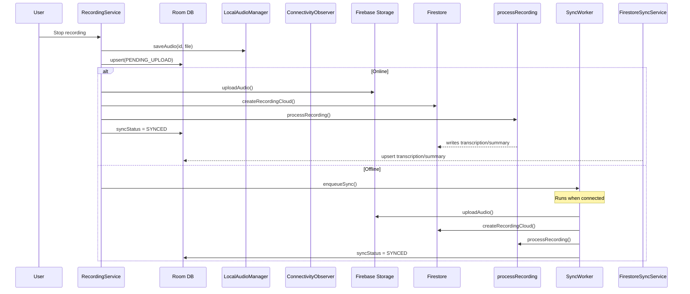

# Phase 2: Recordings -- Local-First with Offline Support

## Prerequisite: Hilt Worker Dependency

`@HiltWorker` requires `androidx.hilt:hilt-work` and `hilt-work-compiler`. Neither exists in the project yet, and `VoiceMindApp` does not implement `Configuration.Provider` with `HiltWorkerFactory`.

**[libs.versions.toml](android/gradle/libs.versions.toml)** -- add:

```toml
# [versions]
hiltWork = "1.2.0"

# [libraries]
hilt-work = { group = "androidx.hilt", name = "hilt-work", version.ref = "hiltWork" }
hilt-work-compiler = { group = "androidx.hilt", name = "hilt-compiler", version.ref = "hiltWork" }
```

**[build.gradle.kts](android/app/build.gradle.kts)** -- add:

```kotlin
implementation(libs.hilt.work)
ksp(libs.hilt.work.compiler)
```

**[VoiceMindApp.kt](android/app/src/main/java/com/voicemind/VoiceMindApp.kt)** -- implement `Configuration.Provider`:

```kotlin
@HiltAndroidApp
class VoiceMindApp : Application(), Configuration.Provider {
    @Inject lateinit var workerFactory: HiltWorkerFactory

    override val workManagerConfiguration: Configuration
        get() = Configuration.Builder().setWorkerFactory(workerFactory).build()
}
```

Also add `android:name=".VoiceMindApp"` to `AndroidManifest.xml` (if not already present) and disable default WorkManager initialization via a manifest provider removal.

---

## 1. RecordingService -- Keep Audio Locally

**File:** [RecordingService.kt](android/app/src/main/java/com/voicemind/service/RecordingService.kt)

**New injections:** `LocalAudioManager`, `ConnectivityObserver`, `RecordingDao`, `SyncScheduler`

**Change in `handleStopSave()`** (currently lines ~191-240):

The current flow is:

1. Upload audio to Storage (`storageRepository.uploadAudio`)
2. Create Firestore doc (`recordingRepository.createRecording`)
3. Call `processRecording` cloud function
4. Delete local file (`file.delete()`)

New flow:

1. Save audio locally via `localAudioManager.saveAudio(recordingId, file)` -- returns absolute path
2. Insert into Room via `recordingDao.upsert()` with `syncStatus = PENDING_UPLOAD`, `localAudioPath`, pre-computed `audioPath = "users/{uid}/audio/{recordingId}.m4a"`
3. If `connectivityObserver.isOnline.value == true`:
  - Upload to Storage, create Firestore doc (via new `createRecordingCloud()`), call `processRecording`
  - Update Room `syncStatus = SYNCED`
4. If offline:
  - Enqueue `syncScheduler.enqueueSync()` -- WorkManager will handle it when connected
5. Remove `file.delete()` (audio is now permanently local)

The `catch` block updates `processingFailed = true` in both Room and Firestore (if online).

---

## 2. RecordingRepository -- Dual Write, Local Read

**File:** [RecordingRepository.kt](android/app/src/main/java/com/voicemind/data/repository/RecordingRepository.kt)

**New injections:** `RecordingDao`, `LocalAudioManager`

Key method changes:

- `**observeRecordings()`** -- Change from Firestore `callbackFlow` (lines 26-37) to Room DAO:

```kotlin
  fun observeRecordings(): Flow<List<Recording>> =
      recordingDao.observeAll().map { entities -> entities.map { it.toModel() } }
  

```

- `**observeByFolder(folderId)**` -- Same pattern with `recordingDao.observeByFolder()`
- `**getRecording(recordingId)**` -- Read from Room only (fallback to Firestore removed):

```kotlin
  suspend fun getRecording(recordingId: String): Recording? =
      recordingDao.getById(recordingId)?.toModel()
  

```

- **Rename `createRecording()` to `createRecordingCloud()`** -- This method (lines 61-74) stays cloud-only, used by SyncWorker and RecordingService for online sync
- `**updateTitle()**` -- Dual write: Room first (`PENDING_UPDATE`), then Firestore in try/catch
- `**moveToFolder()**` -- Same dual write pattern
- `**deleteRecording()**` -- Hard delete from Room + delete local audio + soft delete Firestore in try/catch
- `**updateProcessingFailed()**` -- Dual write: Room + Firestore
- `**deleteRecordings()**` -- Calls the updated `deleteRecording()` for each
- `**reassignFolder()**` -- Still Firestore batch (FirestoreSyncService will propagate to Room)
- `**moveRecordingsToFolder()**` -- Still Firestore batch (same reasoning)
- **Keep unchanged:** `observeSharedRecording()`, `getSharedRecording()` (cross-user reads), `generateSummary()`, `invokeProcessRecording()` (cloud function calls)

---

## 3. Playback -- Local File

### RecordingsViewModel

**File:** [RecordingsViewModel.kt](android/app/src/main/java/com/voicemind/ui/recording/RecordingsViewModel.kt)

**New injection:** `RecordingDao`

- `**playAudio(recording)`** (line ~141): Check `recordingDao.getById(recording.id)?.localAudioPath`. If file exists locally, use `setDataSource(localPath)`. Otherwise fall back to `storageRepository.getDownloadUrl()` for pre-migration recordings.
- `**shareAudio(context, recording)**` (line ~257): If local audio exists, copy from `localAudioPath` to cache dir instead of downloading from cloud URL.

### RecordingDetailViewModel

**File:** [RecordingDetailViewModel.kt](android/app/src/main/java/com/voicemind/ui/recording/RecordingDetailViewModel.kt)

**New injection:** `RecordingDao`

- `**loadWaveform()`** (line ~46): Check `recordingDao.getById(recordingId)?.localAudioPath`. If local file exists, extract waveform from it. Otherwise fall back to cloud URL.

---

## 4. StorageRepository -- Add Download

**File:** [StorageRepository.kt](android/app/src/main/java/com/voicemind/data/repository/StorageRepository.kt)

Add one method:

```kotlin
suspend fun downloadAudio(audioPath: String, destinationFile: File) {
    val ref = storage.reference.child(audioPath)
    ref.getFile(destinationFile).await()
}
```

---

## 5. New: FirestoreSyncService -- Cloud-to-Local Sync

**New file:** `android/app/src/main/java/com/voicemind/data/sync/FirestoreSyncService.kt`

Singleton that registers Firestore snapshot listeners and upserts changes into Room.

- `startListening()`: Registers a listener on the user's `recordings` collection (Phase 2 scope; action items, folders, summaries added in Phase 3)
- `stopListening()`: Removes all listeners (called on sign-out)
- **Recordings listener logic**:
  - On `ADDED`/`MODIFIED`: Convert Firestore doc to `RecordingEntity`. For cloud-owned fields (`transcription`, `summary`, `processingFailed`), always overwrite local. For user-edited fields (`title`, `folderId`), only overwrite if local `syncStatus == SYNCED`. Upsert via DAO.
  - On `REMOVED`: Hard delete from Room + delete local audio
- All Room writes dispatched to `Dispatchers.IO` (Firestore callbacks run on main thread)

---

## 6. New: SyncWorker + SyncScheduler -- Local-to-Cloud Sync

### SyncWorker

**New file:** `android/app/src/main/java/com/voicemind/data/sync/SyncWorker.kt`

`@HiltWorker` `CoroutineWorker` that processes pending recordings:

- `PENDING_UPLOAD`: Upload audio from `localAudioPath` to Storage, create Firestore doc via `createRecordingCloud()`, call `processRecording`, update Room `syncStatus = SYNCED`
- `PENDING_UPDATE`: Push updated fields to Firestore, update Room `syncStatus = SYNCED`
- `PENDING_DELETE`: Soft delete in Firestore, hard delete from Room
- On failure: leave `syncStatus` unchanged, return `Result.retry()`

### SyncScheduler

**New file:** `android/app/src/main/java/com/voicemind/data/sync/SyncScheduler.kt`

`@Singleton` utility that enqueues `SyncWorker` via `WorkManager.enqueueUniqueWork()` with network constraint and exponential backoff.

---

## 7. New: InitialSyncManager -- First-Launch Hydration

**New file:** `android/app/src/main/java/com/voicemind/data/sync/InitialSyncManager.kt`

One-time migration that populates Room from Firestore for existing users:

- Detects first run: `NavPreferenceRepository.isInitialSyncComplete` is false AND user is signed in
- Fetches all recordings (and in Phase 3: action items, folders, summaries) from Firestore
- Inserts into Room with `syncStatus = SYNCED`, `localAudioPath = null`
- Marks sync complete in DataStore
- Audio files are NOT downloaded (playback falls back to cloud URL; on-demand download in Phase 5)

**[NavPreferenceRepository.kt](android/app/src/main/java/com/voicemind/data/repository/NavPreferenceRepository.kt)** -- add:

```kotlin
private val initialSyncCompleteKey = booleanPreferencesKey("initial_sync_complete")

val isInitialSyncComplete: Flow<Boolean> = context.dataStore.data.map { prefs ->
    prefs[initialSyncCompleteKey] ?: false
}

suspend fun setInitialSyncComplete(value: Boolean) {
    context.dataStore.edit { prefs -> prefs[initialSyncCompleteKey] = value }
}
```

---

## 8. Lifecycle Wiring

**[VoiceMindApp.kt](android/app/src/main/java/com/voicemind/VoiceMindApp.kt)** or **[MainActivity.kt](android/app/src/main/java/com/voicemind/MainActivity.kt)**:

- After successful authentication (`isSignedIn == true`):
  1. Run `InitialSyncManager.runIfNeeded()` (one-time)
  2. Call `FirestoreSyncService.startListening()` (ongoing)
- On sign-out: Call `FirestoreSyncService.stopListening()`

Best place: `MainActivity` already has the `isSignedIn` flow. Add a `LaunchedEffect(isSignedIn)` block that triggers initial sync then starts listening. Inject `FirestoreSyncService` and `InitialSyncManager` into `MainActivity`.

---

## Files Summary

**New files (4):**

- `data/sync/FirestoreSyncService.kt`
- `data/sync/SyncWorker.kt`
- `data/sync/SyncScheduler.kt`
- `data/sync/InitialSyncManager.kt`

**Modified files (9):**

- `android/gradle/libs.versions.toml` -- add hilt-work version + libraries
- `android/app/build.gradle.kts` -- add hilt-work dependencies
- `android/app/src/main/java/com/voicemind/VoiceMindApp.kt` -- implement `Configuration.Provider` for HiltWorkerFactory
- `android/app/src/main/java/com/voicemind/service/RecordingService.kt` -- keep audio locally, insert Room, conditional cloud
- `android/app/src/main/java/com/voicemind/data/repository/RecordingRepository.kt` -- local-first reads, dual writes
- `android/app/src/main/java/com/voicemind/data/repository/StorageRepository.kt` -- add `downloadAudio()`
- `android/app/src/main/java/com/voicemind/data/repository/NavPreferenceRepository.kt` -- add `isInitialSyncComplete`
- `android/app/src/main/java/com/voicemind/ui/recording/RecordingsViewModel.kt` -- local file playback + share
- `android/app/src/main/java/com/voicemind/ui/recording/RecordingDetailViewModel.kt` -- local file waveform
- `android/app/src/main/java/com/voicemind/MainActivity.kt` -- wire InitialSyncManager + FirestoreSyncService lifecycle

**Possibly modified:**

- `AndroidManifest.xml` -- disable default WorkManager initializer (if needed)

---

## Data Flow After Phase 2




