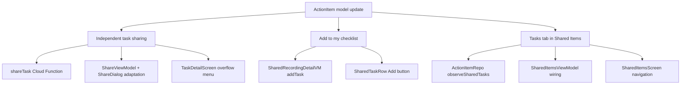

# Phase 9: Task Sharing

Phase 9 has four distinct workstreams: (A) data model update, (B) independent task sharing via Cloud Function + ChecklistScreen/TaskDetailScreen, (C) "Add to my checklist" from shared recording detail, and (D) populating the Tasks pill tab in Shared Items.




---

## A. Data Model Update

**File:** [ActionItem.kt](android/app/src/main/java/com/voicemind/data/model/ActionItem.kt)

Add two nullable fields at the end of the data class:

```kotlin
val sharedFromUid: String? = null,
val sharedFromName: String? = null,
```

---

## B. Independent Task Sharing (share a task from your checklist to another user)

### B1. Cloud Function: `shareTask` callable

**File:** [functions/src/sharing.ts](functions/src/sharing.ts)

Create a new `shareTask` export (separate from `shareItem` since the semantics are fundamentally different -- copy-based, no inbox/outbox):

- Input: `{ taskId: string, recipientUid: string }`
- Auth check, validate inputs, prevent self-share
- Read `users/{callerUid}/actionItems/{taskId}` -- verify exists
- Read `users/{recipientUid}` -- verify recipient exists
- Read `users/{callerUid}` -- get caller's `displayName` for `sharedFromName`
- Write to `users/{recipientUid}/actionItems/{auto-id}`:
  - Copy: `title`, `notes`, `dueDate`, `deadline`
  - Set: `sharedFromUid = callerUid`, `sharedFromName = callerDisplayName`, `completed = false`, `createdAt = serverTimestamp()`
  - Omit: `recordingId`, `googleTaskId`, `calendarEventId`, `autoScheduled`, `sharedWith`
- No `sharedWithMe`/`myShares` entries created
- Return `{ success: true }`

### B2. SharingRepository + ShareViewModel adaptation

**File:** [SharingRepository.kt](android/app/src/main/java/com/voicemind/data/repository/SharingRepository.kt)

Add `shareTask(taskId: String, recipientUid: String)` method calling the `shareTask` callable.

**File:** [ShareViewModel.kt](android/app/src/main/java/com/voicemind/ui/sharing/ShareViewModel.kt)

In `shareItem()`, branch on `itemType`:

- If `itemType == "task"`: call `sharingRepository.shareTask(itemId, foundUser.uid)` instead of `shareItem()`
- For tasks, skip `observeMyShares()` in `setItem()` (no outbox entries exist)

**File:** [ShareDialog.kt](android/app/src/main/java/com/voicemind/ui/sharing/ShareDialog.kt)

- Rename parameter `recordingId` to `itemId` for clarity (it's already mapped to `itemId` internally via `viewModel.setItem()`)
- Update callers in [RecordingsScreen.kt](android/app/src/main/java/com/voicemind/ui/recording/RecordingsScreen.kt) and [RecordingDetailScreen.kt](android/app/src/main/java/com/voicemind/ui/recording/RecordingDetailScreen.kt) to use `itemId = recording.id`
- Hide the "Shared with" section when `itemType == "task"` (since no `myShares` entries)

### B3. TaskDetailScreen: add "Share with User" action

**File:** [TaskDetailScreen.kt](android/app/src/main/java/com/voicemind/ui/checklist/TaskDetailScreen.kt)

- Add an overflow menu (three-dot icon) to the `VoiceMindTopAppBar` actions area
- Add "Share with User" menu item with `PersonAdd` icon
- When tapped: show `ShareDialog(itemId = itemId, itemType = "task")`
- Add local state `var showShareDialog by remember { mutableStateOf(false) }` and the `ShareDialog` composable call

---

## C. "Add to My Checklist" from Shared Recordings

### C1. Repository + ViewModel

**File:** [ActionItemRepository.kt](android/app/src/main/java/com/voicemind/data/repository/ActionItemRepository.kt)

Add method to write a task copied from a shared recording, using a deterministic document ID for dedup:

```kotlin
suspend fun addSharedTask(
    originalTaskId: String,
    ownerUid: String,
    ownerName: String,
    title: String,
    notes: String?,
    dueDate: Timestamp?,
    deadline: Timestamp?,
    completed: Boolean,
) {
    val docId = "shared-${ownerUid}-${originalTaskId}"
    collection().document(docId).set(mapOf(
        "title" to title,
        "notes" to notes,
        "dueDate" to dueDate,
        "deadline" to deadline,
        "completed" to completed,
        "sharedFromUid" to ownerUid,
        "sharedFromName" to ownerName,
        "createdAt" to Timestamp.now(),
    )).await()
}

suspend fun isSharedTaskAdded(originalTaskId: String, ownerUid: String): Boolean {
    val docId = "shared-${ownerUid}-${originalTaskId}"
    return collection().document(docId).get().await().exists()
}
```

The deterministic ID `shared-{ownerUid}-{originalTaskId}` ensures idempotent writes and easy existence checks.

**File:** [SharedRecordingDetailViewModel.kt](android/app/src/main/java/com/voicemind/ui/sharing/SharedRecordingDetailViewModel.kt)

- Add `addedTaskIds: Set<String> = emptySet()` to `SharedRecordingDetailUiState`
- In the init block where tasks are observed, after tasks arrive, check which have already been added (parallel `async` calls to `actionItemRepository.isSharedTaskAdded()`)
- Add `addTaskToChecklist(task: ActionItem)` function:
  - Calls `actionItemRepository.addSharedTask(...)` with `ownerUid` and `state.ownerName`
  - On success: adds task ID to `addedTaskIds`

### C2. SharedRecordingDetailScreen: Add button on each task row

**File:** [SharedRecordingDetailScreen.kt](android/app/src/main/java/com/voicemind/ui/sharing/SharedRecordingDetailScreen.kt)

- Update `SharedTasksCard` and `SharedTaskRow` signatures to accept `addedTaskIds: Set<String>` and `onAddTask: (ActionItem) -> Unit`
- Add an `Add` (`PlaylistAdd` or `AddTask`) icon button on each task row
- Button is disabled when `task.id in addedTaskIds`
- Pass `state.addedTaskIds` and `viewModel::addTaskToChecklist` from the main composable

---

## D. Tasks Pill Tab in Shared Items

### D1. ActionItemRepository

**File:** [ActionItemRepository.kt](android/app/src/main/java/com/voicemind/data/repository/ActionItemRepository.kt)

Add method:

```kotlin
fun observeSharedTasks(): Flow<List<ActionItem>> = callbackFlow {
    val registration = collection()
        .whereNotEqualTo("sharedFromUid", null)
        .orderBy("createdAt", Query.Direction.DESCENDING)
        .addSnapshotListener { snapshot, error ->
            if (error != null) { Timber.e(error, "observeSharedTasks"); return@addSnapshotListener }
            trySend(snapshot?.toObjects(ActionItem::class.java) ?: emptyList())
        }
    awaitClose { registration.remove() }
}
```

### D2. SharedItemsViewModel

**File:** [SharedItemsViewModel.kt](android/app/src/main/java/com/voicemind/ui/sharing/SharedItemsViewModel.kt)

- Inject `ActionItemRepository`
- In `init`, observe `actionItemRepository.observeSharedTasks()` and map to a task-specific UI model
- Create a simple `SharedTaskUiModel(val id: String, val title: String, val sharedFromName: String, val completed: Boolean)` (can be an inner data class or added to the file)
- Replace `tasks: List<SharedItemUiModel>` in `SharedItemsUiState` with `tasks: List<SharedTaskUiModel>` (different data source -- no `shareId`, no dismiss)

### D3. SharedItemsScreen + AppNavHost

**File:** [SharedItemsScreen.kt](android/app/src/main/java/com/voicemind/ui/sharing/SharedItemsScreen.kt)

- Add `onTaskClick: (taskId: String) -> Unit` callback parameter
- Replace the Tasks tab content: use a dedicated `SharedTaskItemRow` composable showing task title, "Shared by [name]", completion icon, and no dismiss button (these are the user's own actionItems)
- `onClick` navigates to `TaskDetailScreen` via `onTaskClick(task.id)`

**File:** [AppNavHost.kt](android/app/src/main/java/com/voicemind/ui/navigation/AppNavHost.kt)

- Pass `onTaskClick` to `SharedItemsScreen` (both drawer-mode and bottom-bar-mode composable calls):

```kotlin
SharedItemsScreen(
    onBack = { navController.popBackStack() },
    onRecordingClick = { ownerUid, recordingId ->
        navController.navigate(sharedRecordingDetailRoute(ownerUid, recordingId))
    },
    onTaskClick = { taskId -> navController.navigate(taskDetailRoute(taskId)) },
)
```

---

## E. TaskDetailScreen Attribution (minor)

**File:** [TaskDetailScreen.kt](android/app/src/main/java/com/voicemind/ui/checklist/TaskDetailScreen.kt)

After the existing "From [recordingTitle]" section (lines 125-131), add:

```kotlin
if (item.sharedFromName != null) {
    Text(
        text = "Shared by ${item.sharedFromName}",
        style = MaterialTheme.typography.bodySmall,
        color = MaterialTheme.colorScheme.primary,
        modifier = Modifier.padding(bottom = 16.dp),
    )
}
```

---

## Summary of Files Changed

- [ActionItem.kt](android/app/src/main/java/com/voicemind/data/model/ActionItem.kt) -- add 2 fields
- [functions/src/sharing.ts](functions/src/sharing.ts) -- add `shareTask` callable (~40 lines)
- [SharingRepository.kt](android/app/src/main/java/com/voicemind/data/repository/SharingRepository.kt) -- add `shareTask` method
- [ActionItemRepository.kt](android/app/src/main/java/com/voicemind/data/repository/ActionItemRepository.kt) -- add `addSharedTask`, `isSharedTaskAdded`, `observeSharedTasks`
- [ShareViewModel.kt](android/app/src/main/java/com/voicemind/ui/sharing/ShareViewModel.kt) -- branch on `itemType == "task"`
- [ShareDialog.kt](android/app/src/main/java/com/voicemind/ui/sharing/ShareDialog.kt) -- rename parameter, hide "Shared with" for tasks
- [RecordingsScreen.kt](android/app/src/main/java/com/voicemind/ui/recording/RecordingsScreen.kt) -- update `ShareDialog` call-site parameter name
- [RecordingDetailScreen.kt](android/app/src/main/java/com/voicemind/ui/recording/RecordingDetailScreen.kt) -- update `ShareDialog` call-site parameter name
- [TaskDetailScreen.kt](android/app/src/main/java/com/voicemind/ui/checklist/TaskDetailScreen.kt) -- add overflow menu + share action + attribution
- [SharedRecordingDetailScreen.kt](android/app/src/main/java/com/voicemind/ui/sharing/SharedRecordingDetailScreen.kt) -- add "Add to my checklist" buttons
- [SharedRecordingDetailViewModel.kt](android/app/src/main/java/com/voicemind/ui/sharing/SharedRecordingDetailViewModel.kt) -- add `addedTaskIds` state + `addTaskToChecklist`
- [SharedItemsViewModel.kt](android/app/src/main/java/com/voicemind/ui/sharing/SharedItemsViewModel.kt) -- inject `ActionItemRepository`, observe shared tasks
- [SharedItemsScreen.kt](android/app/src/main/java/com/voicemind/ui/sharing/SharedItemsScreen.kt) -- add `onTaskClick`, update Tasks tab
- [AppNavHost.kt](android/app/src/main/java/com/voicemind/ui/navigation/AppNavHost.kt) -- pass `onTaskClick` to `SharedItemsScreen`

---

## Action Items on Your End

1. **Deploy the new cloud function** after implementation:

```
   cd functions && npm run build && firebase deploy --only functions:shareTask
   

```

1. **Firestore index** -- the `observeSharedTasks()` query (`whereNotEqualTo("sharedFromUid", null)` + `orderBy("createdAt")`) will require a composite index. Firebase will log the index creation URL in the console when first run. You need to create this index.
2. **Build verification**: `cd android && ./gradlew compileDebugKotlin 2>&1`
3. **End-to-end testing** (two accounts):
  - From Account A, open a task in TaskDetailScreen, tap overflow, tap "Share with User", look up Account B, share
  - Verify the task appears in Account B's Checklist (TO-DO section) with "Shared by [name]" attribution
  - Verify it also appears in Account B's Shared Items > Tasks tab
  - Open a shared recording with tasks, tap "Add to my checklist" on a task -- verify it appears in checklist
  - Tap the same "Add" button again -- verify it's disabled (already added)
  - Close and reopen the shared recording -- verify the "Add" button is still disabled for previously added tasks
  - Edit/complete a shared task -- verify it only affects the recipient's copy

