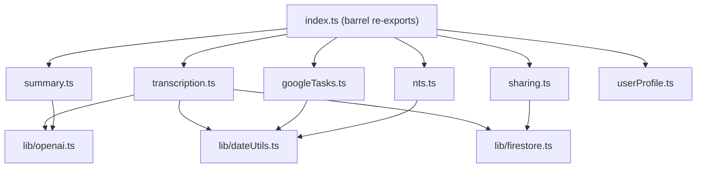

# Refactor functions/src/index.ts

## Architecture: File Split

Split the monolith into feature-based modules. `index.ts` becomes a thin barrel that re-exports all Cloud Functions. Since `tsconfig.json` uses `module: "NodeNext"`, all local imports must use `.js` extensions.




**Target files and their exports:**

- [functions/src/index.ts](functions/src/index.ts) -- barrel: `export * from "./transcription.js"` etc. Plus `admin.initializeApp()`, `setGlobalOptions()`, and secret definitions.
- `functions/src/lib/openai.ts` -- `callOpenAI()` helper, `OpenAIChatResponse` interface, `transcribeAudio()`
- `functions/src/lib/dateUtils.ts` -- `parseLocalDateTimeInTimezone()`, `parseDateAsNoonUtc()`, `getLocalComponents()`, `localToUtc()`
- `functions/src/lib/firestore.ts` -- shared `db`, `storage` exports, `buildAndCommitActionItems()` helper
- `functions/src/transcription.ts` -- `processRecording`, `retryExtractActionItems`, `extractActionItems`, `extractActionItemsAggressive`, `parseActionItems`, `ACTION_ITEMS_SCHEMA`
- `functions/src/summary.ts` -- `generateSummary`, `generateCollectiveSummary`
- `functions/src/googleTasks.ts` -- `exchangeTasksAuthCode`, `disconnectTasks`, `syncActionItemToGoogleTasks`, all Google Tasks/Calendar helpers
- `functions/src/sharing.ts` -- `findUserByEmail`, `shareItem`, `revokeShare`, `dismissSharedItem`, `getSharedAudioUrl`
- `functions/src/nts.ts` -- `autoScheduleActionItem`
- `functions/src/userProfile.ts` -- `onUserCreated`

---

## Issue-by-Issue Fixes

### CRITICAL 1: Single-file split (described above)

### CRITICAL 2: Duplicate action-item doc-building block

The 25-line block at lines 96-123 and lines 824-849 are identical. Extract into a shared helper in `lib/firestore.ts`:

```typescript
export async function buildAndCommitActionItems(
  uid: string,
  recordingId: string,
  items: ExtractedActionItem[],
  tz: string
): Promise<void> {
  if (items.length === 0) return;
  const batch = db.batch();
  const ref = db.collection("users").doc(uid).collection("actionItems");
  for (const item of items) {
    const docRef = ref.doc();
    const doc: Record<string, unknown> = {
      title: item.title.substring(0, 200),
      completed: false,
      recordingId,
      createdAt: admin.firestore.FieldValue.serverTimestamp(),
    };
    if (item.notes) doc.notes = item.notes.substring(0, 500);
    if (item.dueDate) {
      const d = parseLocalDateTimeInTimezone(item.dueDate, tz);
      if (d) doc.dueDate = admin.firestore.Timestamp.fromDate(d);
    }
    if (item.deadline) {
      const d = parseDateAsNoonUtc(item.deadline);
      if (d && !isNaN(d.getTime())) doc.deadline = admin.firestore.Timestamp.fromDate(d);
    }
    batch.set(docRef, doc);
  }
  await batch.commit();
}
```

Both `processRecording` and `retryExtractActionItems` collapse to a single call.

### CRITICAL 3: extractActionItems / extractActionItemsAggressive duplication

The ~20 lines of timezone boilerplate and ~30 lines of OpenAI fetch/parse logic are identical. Extract a shared `callExtractionModel()`:

```typescript
async function callExtractionModel(
  transcript: string,
  timezone: string,
  systemPrompt: string,
  userPrompt: string
): Promise<ExtractedActionItem[]> {
  const truncated = transcript.substring(0, 8000);
  const response = await callOpenAI([
    { role: "system", content: systemPrompt },
    { role: "user", content: userPrompt },
  ], { maxTokens: 2048, responseFormat: ACTION_ITEMS_SCHEMA });
  // ... parse with parseActionItems
}
```

Each function then only builds its unique system prompt (using a shared `buildDateContext(tz)` helper for the timezone boilerplate) and delegates to `callExtractionModel`.

### CRITICAL 4: In-memory rate limiting is non-functional

Replace the in-memory `Map` with a Firestore-based sliding window. Use a document per user under a `rateLimits` subcollection with a TTL-style approach:

```typescript
async function checkRateLimit(uid: string): Promise<void> {
  const ref = db.collection("users").doc(uid)
    .collection("rateLimits").doc("findUserByEmail");
  await db.runTransaction(async (tx) => {
    const doc = await tx.get(ref);
    const data = doc.data();
    const now = Date.now();
    const timestamps: number[] = (data?.timestamps || [])
      .filter((t: number) => now - t < RATE_LIMIT_WINDOW_MS);
    if (timestamps.length >= RATE_LIMIT_MAX) {
      throw new HttpsError("resource-exhausted", "Too many lookups. Try again later.");
    }
    timestamps.push(now);
    tx.set(ref, { timestamps });
  });
}
```

Update `firestore.rules` to deny client access to the `rateLimits` subcollection if needed (though it already falls under the `users/{uid}/{document=**}` allow rule -- if we want to block client reads/writes, add a deny rule before the wildcard).

### HIGH 5: OpenAI fetch boilerplate repeated 5 times

Create `lib/openai.ts` with a single `callOpenAI()` helper:

```typescript
export interface OpenAIChatResponse {
  choices: Array<{
    message: {
      content: string;
    };
  }>;
}

export async function callOpenAI(
  messages: Array<{ role: string; content: string }>,
  opts: { model?: string; maxTokens?: number; responseFormat?: unknown }
): Promise<OpenAIChatResponse> {
  const response = await fetch("https://api.openai.com/v1/chat/completions", {
    method: "POST",
    headers: {
      "Content-Type": "application/json",
      Authorization: `Bearer ${openaiApiKey.value()}`,
    },
    body: JSON.stringify({
      model: opts.model ?? "gpt-4o-mini",
      messages,
      max_tokens: opts.maxTokens ?? 300,
      ...(opts.responseFormat ? { response_format: opts.responseFormat } : {}),
    }),
  });
  if (!response.ok) {
    throw new Error(`OpenAI request failed: ${response.status}`);
  }
  return (await response.json()) as OpenAIChatResponse;
}
```

The `openaiApiKey` secret will need to be passed in or accessed from a shared module. Since `defineSecret` must be at the top-level in Firebase Functions, we keep the secret definition in `index.ts` and pass it to the helper or export it from a shared config module.

### HIGH 6: Untyped OpenAI response

Addressed by `OpenAIChatResponse` interface above. All 5 call sites switch from `Record<string, any>` to the typed interface and access `data.choices[0].message.content` directly.

### MEDIUM 7: tasksTokens at root

**Deferred.** Moving `tasksTokens` under `users/{uid}/tasksTokens` would cause it to fall under the existing `users/{uid}/{document=**}` allow rule, making refresh tokens client-readable -- the opposite of what we want. The current deny rule in `firestore.rules` (line 26-28) is correct and intentional. To fix this properly would require:

1. Adding a deny rule for the specific subcollection path BEFORE the wildcard
2. A data migration for existing tokens

This is a separate task that should be done carefully with a migration script.

### MEDIUM 8: Error logs may capture user transcript content

Replace raw response body logging in OpenAI error paths. Currently at lines 659-662 and 769-772:

```typescript
// Before (leaks prompt content in OpenAI error echo)
console.error("OpenAI request failed:", response.status, await response.text());

// After (safe)
console.error("OpenAI request failed:", response.status);
```

This will be naturally addressed by the `callOpenAI` helper which only logs the status code.

### LOW 9: Biased default timezone

Change line 44 from `"America/Los_Angeles"` to `"UTC"` to match `retryExtractActionItems` (line 797):

```typescript
const tz = timezone || "UTC";
```

### LOW 10: WEB_CLIENT_ID as magic string

Move to Firebase environment config or at minimum to a dedicated `lib/config.ts`:

```typescript
export const WEB_CLIENT_ID =
  "685270102033-tupn4a0mm03k7pdrnd1lhlv53gbq605t.apps.googleusercontent.com";
```

---

## Execution Order

The work is ordered to minimize broken intermediate states: shared libraries first, then migrate each feature file, then collapse `index.ts` to a barrel.

## Firestore Rules Update

Add deny rule for `rateLimits` subcollection in [firestore.rules](firestore.rules):

```
match /users/{uid}/rateLimits/{doc} {
  allow read, write: if false;
}
```

Place this BEFORE the `users/{uid}/{document=**}` wildcard match.