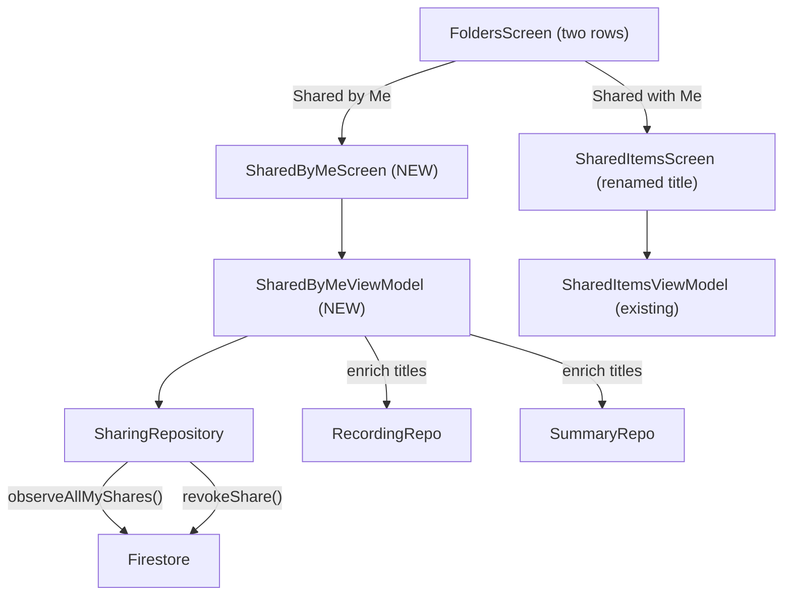

# Shared by Me / Shared with Me

## Architecture




## Changes

### 1. SharingRepository -- add `observeAllMyShares()`

In [SharingRepository.kt](android/app/src/main/java/com/voicemind/data/repository/SharingRepository.kt), add a new method that returns all non-deleted outgoing shares (no `itemId` filter), ordered by `sharedAt` descending. This mirrors the existing `observeMyShares(itemId)` pattern but without the `itemId` WHERE clause.

### 2. New `SharedByMeViewModel`

Create [SharedByMeViewModel.kt](android/app/src/main/java/com/voicemind/ui/sharing/SharedByMeViewModel.kt):

- Collect `observeAllMyShares()` and enrich each `MyShare` with the item title using `RecordingRepository.getRecording()` / `CollectiveSummaryRepository.getSummary()` (same enrichment pattern used in `SharedItemsViewModel`).
- Group shares by `itemId` so each item appears once, with a list of recipients underneath.
- Expose a `revokeShare(shareId, recipientUid)` action that calls `sharingRepository.revokeShare()`.
- UI model:

```kotlin
data class SharedByMeItemUiModel(
    val itemId: String,
    val itemType: String,
    val itemTitle: String,
    val recipients: List<RecipientUiModel>,
)

data class RecipientUiModel(
    val shareId: String,
    val recipientUid: String,
    val recipientName: String,
    val recipientEmail: String,
    val sharedAt: Timestamp?,
)
```

### 3. New `SharedByMeScreen`

Create [SharedByMeScreen.kt](android/app/src/main/java/com/voicemind/ui/sharing/SharedByMeScreen.kt):

- Top bar: title "Shared by Me", back arrow.
- `LazyColumn` of items, each rendered as a card showing:
  - Item title (bold) + item type badge/label
  - Below it, each recipient row with name, email, and a "Revoke" button
- Empty state: "You haven't shared anything yet"
- Uses the same `GlassCard` component pattern as existing screens.

### 4. FoldersScreen -- replace single row with two rows

In [FoldersScreen.kt](android/app/src/main/java/com/voicemind/ui/folders/FoldersScreen.kt):

- Replace the single `SharedItemsRow` (line 111) with two rows:
  - **"Shared by Me"** row -- icon `Icons.Default.Share`, navigates to new screen, shows outgoing count
  - **"Shared with Me"** row -- icon `Icons.Default.FolderShared`, navigates to existing `SharedItemsScreen`, shows unread badge (existing behavior)
- Add `onSharedByMeClick` callback parameter alongside existing `onSharedItemsClick`.

### 5. FoldersViewModel -- add outgoing share count

In [FoldersViewModel.kt](android/app/src/main/java/com/voicemind/ui/folders/FoldersViewModel.kt):

- Add `sharedByMeCount: Int` to `FoldersUiState`.
- Collect `sharingRepository.observeAllMyShares()` and emit the count.

### 6. SharedItemsScreen -- rename title

In [SharedItemsScreen.kt](android/app/src/main/java/com/voicemind/ui/sharing/SharedItemsScreen.kt), change the top bar title from `"Shared Items"` to `"Shared with Me"` (line 55).

### 7. Routes and Navigation

In [Routes.kt](android/app/src/main/java/com/voicemind/ui/navigation/Routes.kt):

- Add `const val SHARED_BY_ME_ROUTE = "shared_by_me"`

In [AppNavHost.kt](android/app/src/main/java/com/voicemind/ui/navigation/AppNavHost.kt):

- Add a new `composable(SHARED_BY_ME_ROUTE)` in `detailRoutes()` that renders `SharedByMeScreen`.
- Pass `onSharedByMeClick = { navController.navigate(SHARED_BY_ME_ROUTE) }` to `FoldersScreen` in both sidebar and pager modes.

### No backend changes needed

The `myShares` Firestore collection and `revokeShare` Cloud Function already exist and work correctly.