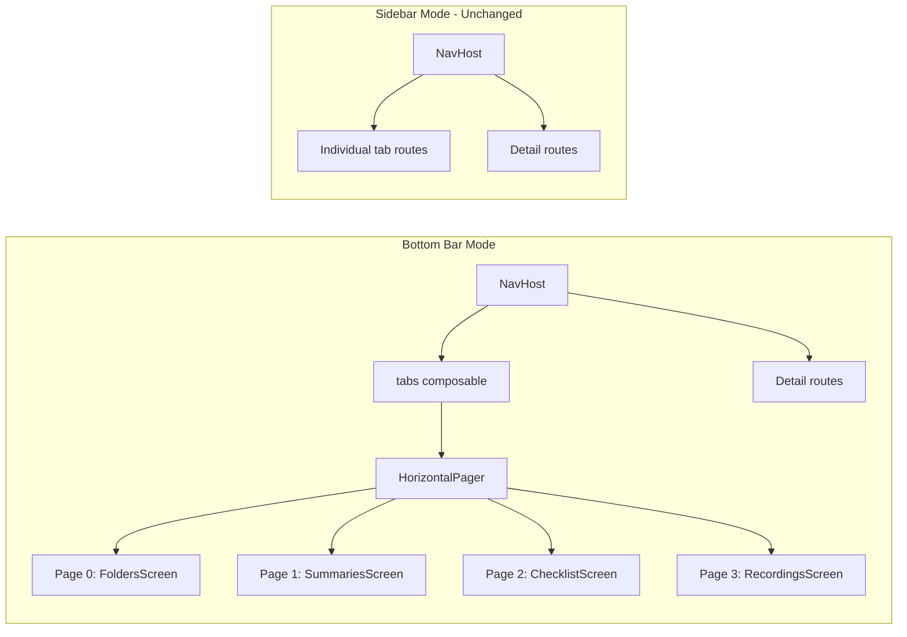

# Swipe Tab Navigation (HorizontalPager)

## Approach

Add a `HorizontalPager` to enable swipe-to-navigate between the 4 main tabs (Folders, Summaries, Checklist, Recordings) in **bottom bar mode only**. Sidebar/drawer mode is completely unchanged.

The key architectural decision: **split the shared `content` lambda into two separate NavHost setups** -- one for sidebar mode (unchanged) and one for bottom bar mode (tabs via `HorizontalPager` + detail routes via `NavHost`).




## Why This Is Safe

- **Zero changes to any screen composable** (RecordingsScreen, ChecklistScreen, SummariesScreen, FoldersScreen, or any detail screen). They all keep their exact same signatures and behavior.
- **Sidebar mode is completely untouched** -- the `if (useSidebar)` branch stays identical.
- **No new dependencies** -- `HorizontalPager` is in `androidx.compose.foundation.pager`, which is already transitively included via the Compose BOM (`2025.12.00`).
- **Detail navigation (task detail, folder detail, recording detail, settings) works exactly as before** -- they push onto the NavHost stack on top of the "tabs" composite destination.

## Single File Change: [AppNavHost.kt](android/app/src/main/java/com/voicemind/ui/navigation/AppNavHost.kt)

### What changes

1. **Extract a `NavGraphBuilder.detailRoutes()` extension** to avoid duplicating the 4 detail route definitions across both modes:

```kotlin
private fun NavGraphBuilder.detailRoutes(
    navController: NavController,
    onSignOut: () -> Unit,
    onOpenDrawer: (() -> Unit)?,
) {
    composable(TASK_DETAIL_ROUTE) { TaskDetailScreen(onBack = { navController.popBackStack() }) }
    composable(Routes.Settings.route) { SettingsScreen(onSignOut = onSignOut, onOpenDrawer = onOpenDrawer) }
    composable(FOLDER_DETAIL_ROUTE) { backStackEntry ->
        val folderId = backStackEntry.arguments?.getString("folderId") ?: return@composable
        FolderDetailScreen(folderId = folderId, onBack = { navController.popBackStack() })
    }
    composable(RECORDING_DETAIL_ROUTE) { backStackEntry ->
        val recordingId = backStackEntry.arguments?.getString("recordingId") ?: return@composable
        RecordingDetailScreen(recordingId = recordingId, navController = navController, onBack = { navController.popBackStack() })
    }
}
```

1. **Sidebar mode (`if (useSidebar)` branch)**: Remove the shared `content` lambda. Inline the NavHost here with individual tab `composable` routes + `detailRoutes(...)`. This is the same logic as today, just moved from the shared lambda.
2. **Bottom bar mode (`else` branch)**: Replace the shared `content` lambda with a `HorizontalPager`-based setup:
  - A `"tabs"` composite route in the NavHost that renders the `HorizontalPager`
  - `pagerState` hoisted above the NavHost (using `rememberPagerState`) so it survives detail-screen navigation
  - `beyondBoundsPageCount = orderedNavItems.size - 1` to keep all 4 pages alive (prevents scroll position and local state loss when swiping away)
  - Bidirectional sync between `BottomNavBar` and pager:
    - **Bottom nav tap** -> `pagerState.animateScrollToPage(index)` (when on tabs), or `popBackStack` to "tabs" then animate (when on detail screen)
    - **Swipe** -> `pagerState.currentPage` updates -> bottom bar highlight follows automatically via `derivedStateOf`
  - `detailRoutes(...)` alongside the "tabs" route
3. `**openRecordingsOnStart`**: In bottom bar mode, scroll the pager to the Recordings page instead of calling `navigateTo`.

### Key details for the HorizontalPager page rendering

Inside the pager, each page renders the same screen composable with the same callbacks as today:

```kotlin
HorizontalPager(
    state = pagerState,
    beyondBoundsPageCount = orderedNavItems.size - 1,
) { page ->
    when (orderedNavItems[page]) {
        Routes.Recordings -> RecordingsScreen(
            navController = navController, onSettings = onSettings,
        )
        Routes.Checklist -> ChecklistScreen(
            onTaskClick = { navController.navigate(taskDetailRoute(it)) },
            onSettings = onSettings,
        )
        Routes.Summaries -> SummariesScreen(onSettings = onSettings)
        Routes.Folders -> FoldersScreen(
            onFolderClick = { navController.navigate(folderDetailRoute(it)) },
            onSettings = onSettings,
        )
        else -> {}
    }
}
```

Note: `onOpenDrawer` is passed as `null` in bottom bar mode because the drawer doesn't exist. This matches the current behavior (line 74-78 in `AppNavHost.kt` already sets `onOpenDrawer = null` when `!useSidebar`).

### Bottom nav bar sync

```kotlin
val pagerCurrentRoute by remember {
    derivedStateOf { orderedNavItems[pagerState.currentPage].route }
}

// Use pagerCurrentRoute for bottom bar highlighting when on "tabs"
// Use currentRoute when on a detail screen
BottomNavBar(
    currentRoute = if (currentRoute == "tabs" || currentRoute == null)
        pagerCurrentRoute else currentRoute,
    onNavigate = { destination ->
        val index = orderedNavItems.indexOf(destination)
        if (index >= 0) {
            if (currentRoute != "tabs") {
                navController.popBackStack("tabs", inclusive = false)
            }
            scope.launch { pagerState.animateScrollToPage(index) }
        }
    },
    items = orderedNavItems,
)
```

## Edge Cases Handled

- **Tab reorder in settings**: `orderedNavItems` is reactive. When the order changes, the `HorizontalPager` recomposes with the new page-to-screen mapping. The `key(orderedNavItems)` wrapper on `rememberPagerState` ensures the pager resets cleanly if the order changes.
- **Detail screen back navigation**: Pressing back from a detail screen pops back to "tabs". The `pagerState` is hoisted above the NavHost, so it remembers the last page.
- **Swipe on detail screens**: Detail screens are pushed on top of "tabs" in the NavHost. The pager is not visible or interactive -- no swipe conflict.
- **Sidebar vs bottom bar**: The pager only exists in the `else` (bottom bar) branch. Sidebar mode has no swipe conflict with the drawer gesture.
- **Page state preservation**: `beyondBoundsPageCount = orderedNavItems.size - 1` keeps all 4 pages composed so scroll positions, text input states, and dialog states survive swiping away and back.
- **ViewModel scoping**: Each tab screen uses `hiltViewModel()` which scopes to the NavBackStackEntry. Since the tab screens use different ViewModel types (`RecordingsViewModel`, `ChecklistViewModel`, `SummariesViewModel`, `FoldersViewModel`), they get separate instances even though they share the "tabs" entry.

