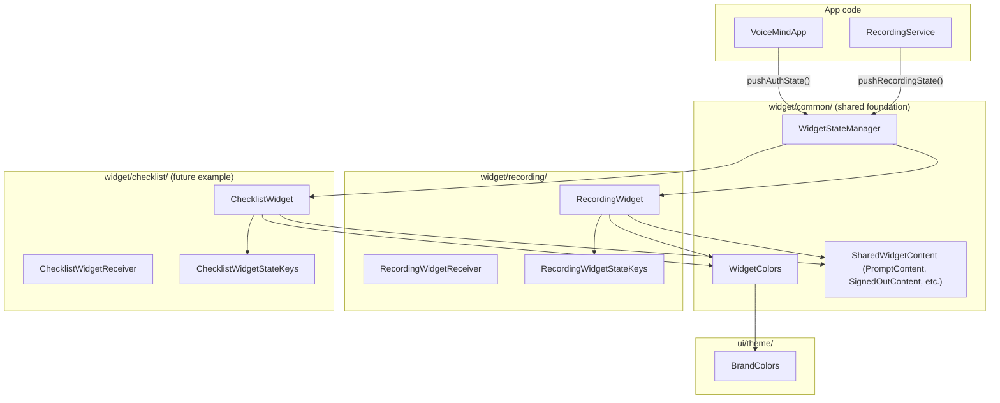

# Widget Foundation Architecture

## What Changes

The existing `com.voicemind.widget` flat package (3 files) will be restructured into a layered package hierarchy with shared infrastructure. No new Gradle modules -- widgets run in the same APK, and a separate module adds build complexity without meaningful benefit for this project size.

## Target Package Structure

```
com.voicemind.widget/
  common/
    WidgetStateManager.kt       -- centralized Glance state push logic (NEW)
    WidgetColors.kt             -- derives colors from BrandColors (MOVED + REFACTORED)
    SharedWidgetContent.kt      -- PromptContent, SignedOutContent, MicPermissionContent (NEW)
  recording/
    RecordingWidget.kt          -- (MOVED from widget/)
    RecordingWidgetReceiver.kt  -- (EXTRACTED from RecordingWidget.kt)
    RecordingWidgetStateKeys.kt -- (MOVED from widget/)
```

Each future widget (e.g. Checklist, QuickRecord) will get its own sub-package following the same pattern:

```
  checklist/
    ChecklistWidget.kt
    ChecklistWidgetReceiver.kt
    ChecklistWidgetStateKeys.kt
```

## File-by-File Changes

### 1. Create `BrandColors` single source of truth

**File:** [android/app/src/main/java/com/voicemind/ui/theme/Color.kt](android/app/src/main/java/com/voicemind/ui/theme/Color.kt)

Add a `BrandColors` object at the top of the existing file, **above** the current `M3Light_`* / `M3Dark_`* definitions. Then change the `M3Light_*` vals to reference `BrandColors` instead of hardcoded hex:

```kotlin
object BrandColors {
    val Primary           = Color(0xFF0061A4)
    val OnPrimary         = Color(0xFFFFFFFF)
    val PrimaryContainer  = Color(0xFFD1E4FF)
    val Error             = Color(0xFFBA1A1A)
    val ErrorContainer    = Color(0xFFFFDAD6)
    val Background        = Color(0xFFFDFCFF)
    val OnBackground      = Color(0xFF1A1C1E)
    val OnSurface         = Color(0xFF1A1C1E)
    val OnSurfaceVariant  = Color(0xFF43474E)
    val Warning           = Color(0xFFE6A817)
    // ... other brand constants
}

internal val M3Light_Primary = BrandColors.Primary
internal val M3Light_OnPrimary = BrandColors.OnPrimary
// ... etc
```

### 2. Refactor `WidgetColors` to use `BrandColors`

**File:** `android/app/src/main/java/com/voicemind/widget/common/WidgetColors.kt` (moved from `widget/`)

```kotlin
package com.voicemind.widget.common

import com.voicemind.ui.theme.BrandColors

object WidgetColors {
    val Background      = ColorProvider(BrandColors.Background)
    val Label           = ColorProvider(BrandColors.OnSurface)
    val SecondaryLabel  = ColorProvider(BrandColors.OnSurfaceVariant)
    val Accent          = ColorProvider(BrandColors.Primary)
    val Destructive     = ColorProvider(BrandColors.Error)
    // ... etc -- no more hardcoded hex in this file
}
```

### 3. Create `WidgetStateManager`

**File:** `android/app/src/main/java/com/voicemind/widget/common/WidgetStateManager.kt` (NEW)

Centralizes the duplicated `pushWidgetState` pattern from [VoiceMindApp.kt](android/app/src/main/java/com/voicemind/VoiceMindApp.kt) (line 105) and [RecordingService.kt](android/app/src/main/java/com/voicemind/service/RecordingService.kt) (line 350):

```kotlin
package com.voicemind.widget.common

object WidgetStateManager {

    suspend fun pushAuthState(
        context: Context,
        isSignedIn: Boolean,
        needsMicPermission: Boolean,
    ) {
        updateWidgetState<RecordingWidget>(context) { prefs ->
            prefs[RecordingWidgetStateKeys.IS_SIGNED_IN] = isSignedIn
            prefs[RecordingWidgetStateKeys.NEEDS_MIC_PERMISSION] = needsMicPermission
        }
    }

    suspend fun pushRecordingState(
        context: Context,
        isSignedIn: Boolean,
        needsMicPermission: Boolean,
        isRecording: Boolean,
        isPaused: Boolean,
        elapsedSeconds: Long,
    ) {
        updateWidgetState<RecordingWidget>(context) { prefs ->
            prefs[RecordingWidgetStateKeys.IS_SIGNED_IN] = isSignedIn
            prefs[RecordingWidgetStateKeys.NEEDS_MIC_PERMISSION] = needsMicPermission
            prefs[RecordingWidgetStateKeys.IS_RECORDING] = isRecording
            prefs[RecordingWidgetStateKeys.IS_PAUSED] = isPaused
            prefs[RecordingWidgetStateKeys.ELAPSED_SECONDS] = elapsedSeconds
        }
    }

    private suspend inline fun <reified T : GlanceAppWidget> updateWidgetState(
        context: Context,
        crossinline block: (MutablePreferences) -> Unit,
    ) {
        try {
            val manager = GlanceAppWidgetManager(context)
            val ids = manager.getGlanceIds(T::class.java)
            ids.forEach { id ->
                updateAppWidgetState(context, id) { prefs -> block(prefs) }
                T::class.java.getDeclaredConstructor().newInstance().update(context, id)
            }
        } catch (_: Exception) { }
    }
}
```

### 4. Extract shared widget composables

**File:** `android/app/src/main/java/com/voicemind/widget/common/SharedWidgetContent.kt` (NEW)

Move `PromptContent` (currently private in `RecordingWidget.kt` line 101), `SignedOutContent` (line 89), and `MicPermissionContent` (line 140) here as `internal` functions. Every future widget needs signed-out and permission-fallback UIs -- these become the shared building blocks.

```kotlin
package com.voicemind.widget.common

@Composable
internal fun SignedOutContent() { ... }

@Composable
internal fun MicPermissionContent() { ... }

@Composable
internal fun PromptContent(subtitle: String, buttonLabel: String, intent: Intent) { ... }

@Composable
internal fun WidgetTitle(text: String = "VoiceMind") { ... }
```

### 5. Refactor `RecordingWidget.kt`

**File:** `android/app/src/main/java/com/voicemind/widget/recording/RecordingWidget.kt` (moved)

- Package changes to `com.voicemind.widget.recording`
- Remove `SignedOutContent`, `MicPermissionContent`, `PromptContent` (now in `SharedWidgetContent`)
- Import them from `com.voicemind.widget.common`
- Keep `IdleContent`, `ActiveContent`, `WidgetRoot` as widget-specific private composables

### 6. Extract `RecordingWidgetReceiver`

**File:** `android/app/src/main/java/com/voicemind/widget/recording/RecordingWidgetReceiver.kt` (NEW file, extracted)

Currently a 3-line class at the bottom of `RecordingWidget.kt`. Move to its own file for consistency -- every widget will have a separate Receiver file:

```kotlin
package com.voicemind.widget.recording

class RecordingWidgetReceiver : GlanceAppWidgetReceiver() {
    override val glanceAppWidget: GlanceAppWidget = RecordingWidget()
}
```

### 7. Move `RecordingWidgetStateKeys.kt`

**File:** `android/app/src/main/java/com/voicemind/widget/recording/RecordingWidgetStateKeys.kt`

Package changes to `com.voicemind.widget.recording`. Content stays the same.

### 8. Update callers

**[VoiceMindApp.kt](android/app/src/main/java/com/voicemind/VoiceMindApp.kt):**

- Replace the private `pushWidgetState` method (lines 105-119) with a call to `WidgetStateManager.pushAuthState()`
- Remove direct imports of `GlanceAppWidgetManager`, `updateAppWidgetState`, `RecordingWidget`, `RecordingWidgetStateKeys`
- Add import for `WidgetStateManager`

**[RecordingService.kt](android/app/src/main/java/com/voicemind/service/RecordingService.kt):**

- Replace the private `pushWidgetState` method (lines 350-371) with a call to `WidgetStateManager.pushRecordingState()`
- Remove direct Glance imports
- Add import for `WidgetStateManager`

### 9. Update AndroidManifest.xml

**File:** [AndroidManifest.xml](android/app/src/main/AndroidManifest.xml) (line 93)

Update receiver class path from `.widget.RecordingWidgetReceiver` to `.widget.recording.RecordingWidgetReceiver`.

### 10. Resource naming convention (documentation only)

No files are renamed now (avoids churn), but establish the convention in a comment or doc. Future widgets follow:

- Drawables: `widget_{widgetname}_{purpose}.xml` (e.g. `widget_checklist_ic_check.xml`)
- Widget info XML: `{widgetname}_widget_info.xml` (e.g. `checklist_widget_info.xml`)
- Initial layout: `widget_{widgetname}_initial.xml`

## What Does NOT Change

- No new Gradle module -- all widgets ship in the same APK; package-level organization is sufficient
- No drawable renames for the existing recording widget (avoids unnecessary churn)
- `RecordingService` and `VoiceMindApp` stay where they are -- only their widget push code is replaced with `WidgetStateManager` calls
- `ui/theme/Color.kt` keeps all its existing `M3Light_`* / `M3Dark_`* vals -- they just reference `BrandColors` instead of literal hex

## Architecture Diagram




